# 全能工作台（Personal Workbench）

一个自托管的家庭效率系统：把每天要看、要办、要管的事收进同一个入口——天气与新闻、待办与日程、家庭与子女、学习与成长、账务与文件、AI 对话、人工智能与语音板、电子宠物、多账号邮箱。单个 Node.js 进程加一个数据目录，数据全部落在本机 SQLite，不依赖任何第三方托管。


*首页：天气、今日待办与日程、快捷启动、热搜榜、中国节日日历（农历 / 节气 / 家人生日）、科技新闻、子女任务，一屏总览。*

| | |
|---|---|
| **当前版本** | v1.13.3 |
| **运行环境** | Node.js ≥ 22.5（直跑）· Docker · 飞牛 fnOS NAS 应用包 |
| **默认账号** | `admin` / `admin123`（首次登录后请立即修改） |
| **技术栈** | Vue 3 + Vite 前端，Express + `node:sqlite` 后端（零原生依赖、免编译） |
| **存储** | 单进程多库 SQLite（主库 + 每个成员一个租户库） |
| **界面语言** | 简体中文 |

## 为什么做这个

市面上的效率工具大多把数据放在别人的服务器上，功能按订阅制切割，想加上自己真正需要的模块又无从下手。这个项目反着来：整套系统部署在自己家里的设备上，一个进程、一个数据目录，备份就是把文件夹拷走。功能按一个家庭的实际场景生长——邮件在一个地方，账单在另一个地方，孩子的学习记录在第三个地方，智能家居又是一套独立账号，把它们合并进一个自己能掌控、能改代码的系统，用起来才顺手。

目前包含十二个页面模块、上百个页签，覆盖信息聚合、目标与复盘、待办日程、家庭与子女、学习成长、账务记账、文件存档、AI 对话、人工智能语音控制、电子宠物、多账号邮箱，并支持多成员共用一台服务器、各自数据互相隔离。

## 目录

- [功能总览](#功能总览)
- [界面与模块详解](#界面与模块详解)
- [安装部署](#安装部署)
- [首次配置](#首次配置)
- [访问方式](#访问方式)
- [数据与备份](#数据与备份)
- [多成员与权限](#多成员与权限)
- [版本升级](#版本升级)
- [技术架构](#技术架构)
- [目录结构](#目录结构)
- [常见问题](#常见问题)
- [安全说明](#安全说明)

## 功能总览

| 模块 | 主要能力 |
|------|---------|
| 首页 | 天气、今日待办 / 日程、快捷启动、热搜榜、中国节日日历（农历 / 节气 / 家人生日）、科技新闻、子女任务一屏总览 |
| lifeOS | 目标树（愿景 / 年 / 季 / 月四级 + 量化 KR 自动算进度）、行动（复用日程待办，可挂目标与项目）、习惯打卡与连续天数、日 / 周 / 月 / 季 / 年复盘并可沉淀成 SOP、AI复盘IM（IM 归档 → AI 概要 / 重点 / 待办 → 一键落成行动，可勾选「喂给 AI 前先脱敏」并当场看对照表）、项目与六领域看板、关系图谱、知识地图（一句话目标 → AI 技能树 + 学习资源 + 成本表）；进度永不落库、删实体必清关联 |
| 笔记 | 三栏知识系统：多级文件夹树 + 标签、`[[双向链接]]`（含未解析补建与别名）、知识图谱、白板、Dataview 查询、时间线、每日笔记（可自动创建）、统计打卡；另有录音笔记、粘贴富文本转 Markdown、自动标签与 AI 辅助（总结 / 续写 / 翻译前弹「是否先脱敏」确认，选脱敏则先看对照表再发送）、带密码分享链接、IM 聊天记录归档（飞书 / 钉钉 / 企业微信）、批量链接与 AI 连接、外部系统令牌写入 |
| 新闻 | 科技 / 生活 / 本地三类来源，每天 08:00 自动抓取（RSS + AI 搜索双通道），按 URL 去重、全中文过滤；本地新闻按天气城市筛选；历史留存 90 天可按日期翻阅 |
| 邮箱 | 多账号管理（每邮箱独立页签、标签名可自定义）、IMAP 拉取正文与附件、SMTP 收发信、写信上传附件、搜索筛选 + 全选 + 批量已读 / 删除、新邮件弹窗与提示音、关键词标签、附件落盘 |
| 学习 | 听写、视频教学（NAS 目录浏览 / 进度记忆 / 学时记账）、打字练习（游戏 / 诗词 / 歌词 / 钢琴四模式、内容可导入、赚钱日历）、练琴录音、心愿卡 |
| 日程 | 日历优先视图（月历铺排、跨日日程、农历 / 节日 / 信用卡还款日、共享日程）+ 待办清单（优先级 / 截止日期），批量登记入日程，日程推送提醒 |
| 家庭管理 | 家庭事项登记（富文本 + 图片）、孩子档案（公历 / 农历生日、星座、生肖、虚岁）、学习任务下发与跟进、儿童故事（导入 / AI 生成 → 转音频 → 播放下载）、个人账务（账单导入、自动分类、预算、看板） |
| 效率工具 | 录音转写（VibeVoice / Whisper 双引擎，本页默认落点）、智作平台（AI 文案创作）、剪贴板采集、快捷启动、电脑监控（定时截屏 + AI 概览）、语音配音（MOSS-TTS 一键安装）、电子宠物（像素质成，整页并入本页）、推送任务（浏览器自动化 + 定时推送）、**AI 脱敏**（本地规则把公司名 / 人名 / 部门 / 群名 / 账号 / 密码 / API KEY 等的原文换成随机代码再发给 AI，返回后自动拼回，供其它页面调用）、文件存档、全局搜索 |
| 人工智能 | 米家账号 OAuth 绑定与设备控制、数字人（实时音视频对话：AI 男友 / 女友 / 宠物，打字或说话说「打开某某」即由工作台真去控设备、结果如实转达，设置里另有「智能家居控制」页签可控制米家设备）、LLM在线模型（任意 OpenAI 兼容接口 + 附件 + 视觉模型，可勾选【脱敏】后再发、Ctrl+回车直接脱敏发送，右侧展开说明与本轮对照表）、智能板（小智语音板装机与语音控米家）、贾维斯语音助手、Agent 红绿灯、米家参数翻译、视频中心；可一键下载本地烧录工具包，在电脑浏览器里直接读串口烧录智能板与红绿灯；另有独立成飞牛应用的「智能家居」单模块版（`WB_MODE=smarthome`） |
| 短消息 | 成员间站内消息（气泡会话、未读弹窗）、语音消息（限时录音 + 自动转写）、电脑桌面通知、钉钉机器人收发、模块事项自动推送 |
| 设置 | 系统名称、页面排序与改名、天气 / 通勤、新闻源、AI 模型、推送渠道、信用卡账单日、模块共享、SSL 自签名证书、升级管理、飞牛应用、登录日志、前端错误、用户管理、多平台访问 |
| 定时任务 | 新闻抓取、Skill 定时、日程提醒巡检、邮箱按账号独立轮询、每日默认待办生成、每日笔记自动创建、SSL 到期检查、每周数据清理、IM 连接器按各自时点同步 |

## 界面与模块详解

### 首页

首页是每天打开工作台后停留的第一屏，把当天最需要知道的事按重要性铺开：

- **天气**：在设置里填城市名即可定位。内置全国约 400 条城市坐标库，国内城市离线即存，不需要申请 Key，也不要求服务器能访问外网；区县与境外城市走在线定位兜底。
- **今日待办 / 日程**：当天要到期的待办与日程并排列出，看一眼就知道今天该干什么。
- **中国节日日历**：公历节日 + 农历 + 二十四节气 + 家人生日 + 信用卡账单还款日，左侧日历直接标注。
- **热搜榜 / 科技新闻**：当天抓取的热榜与科技资讯摘要。
- **快捷启动**：常用页面与外部链接的自定义入口。
- **子女任务**：孩子当天的学习任务与完成情况。

### 新闻

- 科技 / 生活 / 本地三类来源，每天 **08:00 自动抓取**，RSS 与 AI 搜索两条通道互为补充，按 URL 去重、只保留全中文条目。
- 本地新闻按天气城市过滤——设置里定位到哪座城市，本地分类就收哪座城市的消息。
- 历史留存 90 天，可按日期翻阅往期。
- 内置实测可用的科技与生活 RSS 源；「本地」分类建议替换为你所在城市的 RSS 源。

### 邮箱


*邮箱：顶部按账号分页签、文件夹行、双列列表（第一列显示发件人），操作按钮固定锁定在标题行最右端。*

一个页面管完所有邮箱账号，不区分服务商：

- **多账号页签**：顶部按账号分成页签，标签名可在邮箱设置里改成自己认得的名字；「＋」添加新账号，「邮箱设置」固定为最后一个页签。URL 带 `?acc=账号ID` 可直达某个邮箱。
- **写邮件**：写信按钮位于每个邮箱自己的页签内（文件夹行最右端）——在哪个邮箱的页签里点，就用哪个邮箱发件。写信窗口为放大版（约 880px 宽、正文 14 行），默认显示当前邮箱的发件地址，多邮箱时也可在窗口内切换发件账号。
- **附件上传**：写信窗口内「📎 添加附件」可多选文件（最多 10 个、合计不超过 20MB），发送时随邮件经 SMTP 以 base64 + MIME multipart 编码发出，中文文件名按 RFC 2231 编码。发件箱里的邮件会显示「附件 N」标签与文件清单。
- **操作按钮锁定行尾**：收件箱 / 发件箱 / 草稿箱 / 垃圾箱四个文件夹的操作按钮（拉取新邮件、补拉附件、清空垃圾箱、搜索、全选、批量已读 / 删除）固定锁定在标题行最右端，不随内容换行漂移；窄屏时页签与按钮组各自横向滚动。
- **批量操作**：四个文件夹均支持按主题 / 发件人 / 正文搜索筛选，然后全选、批量已读或批量删除（垃圾箱内为彻底删除）。
- **新邮件提醒**：按账号独立轮询、每账号独立间隔；新邮件通过站内消息弹窗提醒，点击直达对应邮箱页签。弹窗与提示音都可按需开关。
- **关键词标签**：在邮箱设置里维护「关键词 → 标签」规则，新邮件全文命中即在标题最前显示标签（每封邮件最多一个，首个命中优先），例如把所有带「发票」的邮件一眼标出来。
- **附件存储**：拉取到的附件可统一落盘到 NAS 目录（邮箱设置 → 邮件附件存储），未配置时仅登记不落盘。
- 另有通讯录与草稿箱、发件箱、垃圾箱的完整管理。

### 笔记

一套三栏知识系统（左：文件树 / 搜索 / 标签 / 书签 / 模板 / 录音；中：页签 + 编辑器 + 各视图；右：大纲 / 属性 / 链接 / 统计）。完整用法见 [`docs/笔记模块使用说明.md`](docs/笔记模块使用说明.md)，笔记页左栏「❓ 说明」里也有一份。

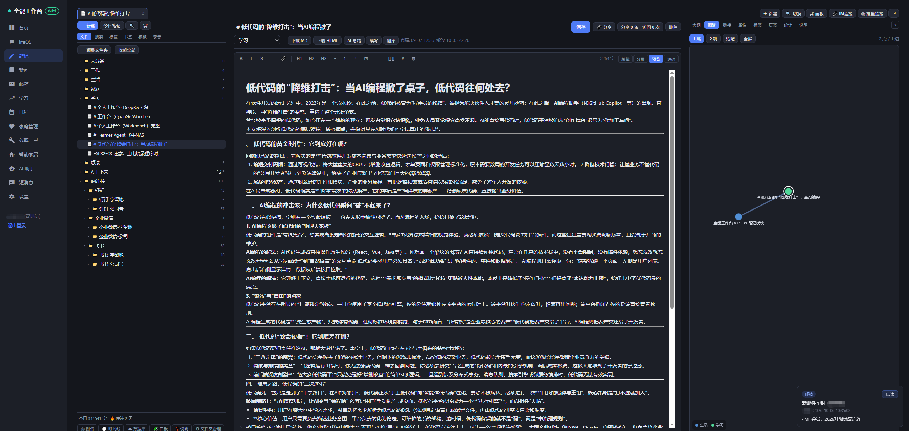

*笔记页打开即是预览态：左侧文件夹树与统计，中间渲染好的正文与工具栏（保存 / 分享 / 下载 / AI），右侧面板可切换大纲 / 图谱 / 链接 / 属性等视图。*

- **编辑器**：Markdown（CodeMirror 6），打开先给预览（直接看渲染结果），在正文上双击就切进编辑、光标在开头；四种模式——编辑 / 分屏 / 预览 / 源码。前两种边写边有色：标题、强调、链接、行内代码实时上色，代码块按 ```js 这样的信息串自动匹配语言（js / ts / json / html / css / python / sql / xml / yaml / java / c / c++ / rust / go / php / vue / markdown / shell / dockerfile / diff / toml / ini / nginx 共 22 种，解析器按需加载）；源码是只读的「代码预览」，只看配好色的 Markdown 源文。
- **粘贴富文本**：从网页复制带图文章直接 `Ctrl+V`，自动转成 Markdown（标题 / 粗斜体 / 链接 / 列表 / 引用 / 代码块 / 表格），图片全部转存为自己的附件直链——`data:` URI 截图与本地上传同路，远程图由服务端代取（绕过浏览器 CORS），单张转存失败不拦整篇、正文里保留原地址。表格整块输出保证 GFM 行连续，预览渲染带边框、表头底色，宽表横向滚动。截图直接粘贴（`Ctrl+V` 文件）同样落附件。
- 工具栏一键加粗、列表、链接、图片、标签、`[[双链]]`；编辑器默认自动换行（长段不顶横向滚动条）；自动保存（停笔 3 秒），保存按钮旁有「自动保存：开/关」开关，关闭时按钮琥珀色提醒、只剩手动保存与 `Ctrl+S` 落盘（离开笔记页仍有「还有没保存」确认兜底）；保存回包不再整篇替换笔记（旧实现保存期间打的字/删的行会被服务器旧稿覆盖——删掉的整行复活、光标跳行），页签可同时开多篇、切回来不重载。右侧八档：大纲 / 图谱 / 链接 / 属性 / 标签 / 页签 / 统计 / 说明——大纲点击滚动到对应标题；图谱画的是这一篇自己的链接关系（1 跳 / 2 跳可切，点邻居直接跳过去，也能一键放开到整页图谱）。头部的「创建 / 修改」时间与 AI 按钮同行（今年的笔记不重复写年份，完整时间戳在悬停提示里）。

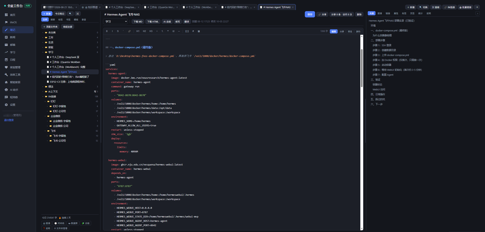

*编辑态的代码块自动语法高亮：键名、字符串、数字各着其色，右侧同屏是大纲面板，写配置类笔记时两边的结构都看得清。*

- **文件夹树**：多级文件夹（如 `工作 / 2026`），拖拽移动、排序、改名；每行徽标显示累计篇数（本层 + 全部后代，悬停给两个数）。标签独立存在，正文里写 `#物理` 即算打标。窄屏（<900px）下左栏是浮动抽屉，顶栏 `☰` 展开。
- **双链**：正文里写 `[[另一篇笔记的标题]]`，命中的直接跳过去；未命中的不丢弃，右侧「链接」面板的「未解析」里列出来，点一下即可新建。改名会留下别名，老的 `[[旧标题]]` 不会断。键入 `[[` 会直接列出已有笔记标题（边打边筛，选中后自动补 `]]`）。出链 / 反链同面板查看。
- **批量链接**：按关键词搜出一批笔记（匹配标题或正文），勾选后执行——**两两互链**（在每篇末尾的「关联笔记」小节里两两互加双链，让这一批笔记互相引用）；**循环链接**（按列表顺序串成一条环，每篇只加一条指向下一篇的链接、末篇链回首篇，适合系列、连载、日记这类有先后关系的笔记，列表标了串链序号、可一键倒序）；**批量取消链接**（前两者的逆操作，只清「关联笔记」小节里的链接条目，正文里手写的 `[[链接]]` 和带说明文字的条目一律不动）；**AI 连接**（不用敲关键词——AI 通读候选笔记的标题 + 摘要，提炼关键字、把内容相关的分成组，挑一组确认后用互链 / 循环链接执行；AI 只筛不写，落链接的仍是前两种操作）。可先筛「从未链接过」或「有过链接」的笔记，范围可选全库或任一文件夹（含子文件夹）；AI 分析在服务器后台跑（进度条 + 过程日志，关弹窗不中断、重开接着看）。四个操作共用同一套规矩：重复执行只补缺，已链过（含手写的同名链接）不会重复加，没有要动的笔记一个字节不动。

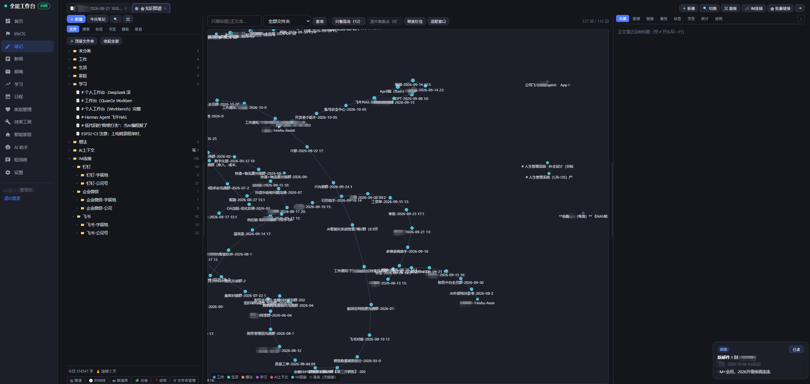

*知识图谱：按顶层文件夹着色的节点与双链连线铺在深色画布上，左下图例可按分类过滤，右上可在图谱 / 链路等视图间切换。*

- **知识图谱**：按顶层文件夹着色、双链连线；孤岛画成空心灰点、集散点加白环；滚轮缩放、拖点钉住、双击进入 N 跳局部图；可只看孤岛 / 居中枢纽 / 按文件夹筛选。`d3-force` 算完 300 拍即停，静止时不吃 CPU。
- **白板**：笔记卡（活链接，始终显示最新标题）/ 文本卡 / 图片卡 / 链接卡；卡片右上小圆点拖到另一张卡即连线；拖动、缩放、改大小后自动落盘，视口位置也记住；50 步撤销。
- **数据库视图（Dataview）**：表单或用 `title ~ "周报" AND words > 200` 这样的查询串筛选，字段支持 `prop.属性名`，结果表格内联编辑，可导出 Markdown 表格。
- **时间线**：按天 / 周 / 月分桶的直方图，点桶展开该时间段里的笔记。
- **搜索**：关键词 / 标签 / 路径 / 正则四种模式；正则跑在后台线程、带 1.5 秒硬超时，危险模式（嵌套量词等）直接拒绝。
- **每日笔记**：`Ctrl+P` 或左栏「今日笔记」打开当天那篇，同一天只会有一条；可在设置里指定默认模板 / 文件夹，并打开「自动创建」——服务器每天凌晨先替你把当天那篇建好（按天幂等）。模板占位符 `{{date}} {{time}} {{title}}`。
- **统计**：今日字数、总字数、连续与最长打卡、每日字数曲线、文件夹分布；左栏底部常驻「今日 N 字 · 连续 N 天」。
- **日历联动**：日程页右上角「显示笔记」开关，打开后每天格子里补上当天写过的笔记标题，点标题跳过来。
- **AI 辅助**：笔记头部「AI ▾」总结 / 续写 / 翻译，结果可插入光标处或整篇替换；另有「AI 概要 + 关键词」一键生成并落库。

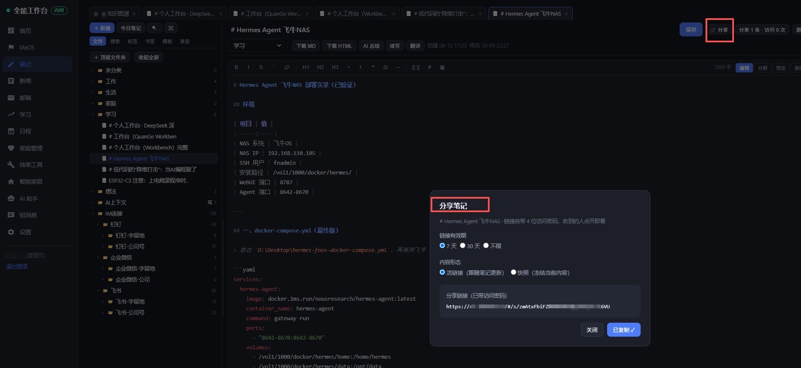

*分享笔记：链接自带 4 位访问密码，收到的人点开即看、无需登录；有效期（7 天 / 30 天 / 不限）与活链接 / 快照随选，这里还显示复制成功的回执。*

- **分享**：给笔记生成访问链接，域名取系统配置的外网地址，链接里拼进 4 位随机访问码，对方点开即看、无需登录。可选有效期（7 天 / 30 天 / 不限）、活链接（跟随更新）或快照（冻结当下内容）；录音笔记还能勾选是否附带音频。笔记页右上角显示该笔记的分享条数与累计访问次数，点进去可随时关闭访问、改有效期或删链接。
- **下载**：一键导出 Markdown 与可直接双击渲染的 HTML；录音笔记可选择把音频一并嵌进文件。
- **录音笔记**：点「新增录音」录制（支持 WAV / MP3 格式），录音页提供转写、下载、播放、删除，并显示起止时间、时长、转写状态、转写耗时、使用模型、文件容量与落盘路径，算力来源与「效率工具 → 录音转写」共用同一份配置。保存流程为三段式步骤条 + 进度条（整理录音 → 编译生成文件 → 上传服务器，上传段是真实字节进度）、上传期间离页拦截，转写时有按历史耗时估算的实时进度条。录音期间自动申请屏幕常亮（Wake Lock，手机锁屏会让录音断续），不支持该特性的老内核会提示手动保持常亮。转写完成后自动生成一篇笔记（同时混排进主列表），并推送一条系统消息，点消息直达该录音页。录音笔记另有独立的「🎙 录音」页签统一查看。

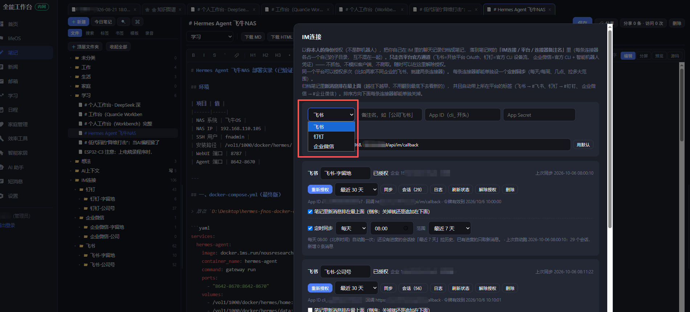

*IM 连接：平台下拉选飞书 / 钉钉 / 企业微信，按各平台的官方通道完成授权；下方是已授权的连接器列表，可重新授权、设定时间范围。*

- **IM 连接（飞书 / 钉钉 / 企业微信）**：把你在飞书 / 钉钉 / 企业微信里的聊天记录按「一会话一篇笔记」归档进笔记树的 **IM连接 / 平台 / 连接器备注名**（每条连接器一个自己的子目录，两家飞书不会混在一起），归档笔记标题为 **对方名称-日期时间-连接器备注名**（单聊取对方显示名、群聊取群名；会话 ID 记在笔记抬头里）。它用的是你本人的身份（OAuth 用户令牌或官方 CLI 凭证），只走官方开放平台通道——不抓包、不模拟客户端、不爬取；令牌 / 凭证存在你自己的租户库或按连接器隔离的加密目录里，任何接口返回前都会把密钥抹掉，随时可「解除授权」（已导出的笔记保留）。同一个平台可以授权多次（两家企业的飞书就建两条连接器）。
  - **飞书**：需要自建应用并完成 OAuth 用户授权。准备应用时必须多做一步：飞书开放平台后台 → 你的应用 →「添加应用能力」→ 勾上「机器人」→ 然后发布版本——读会话列表、读历史消息这整组 `im/v1/*` 接口挂在「机器人」这个应用能力下，光完成授权不够，能力没开就一点同步就报 `232025（Bot ability is not activated）`，而且加完能力要随版本发布出去才在线上生效（这几步在笔记页「IM 连接 → 飞书怎么准备？」里有逐条清单）。点「同步」之前先弹一张预检卡：多少个会话、预计发多少次请求、大概跑多久，并写清飞书频控边界——官方给读会话列表与读历史消息的上限是 1000 次/分钟 且 50 次/秒，本工具串行拉取、每页固定 220ms（约 4.5 次/秒），只有上限的十分之一；超限不会封号，官方对超频的处置只是拒绝这一轮（HTTP 429 + 业务码 99991400），日志里会直接写出建议等多少秒。已知边界：官方列会话接口默认不含单聊（本工具会多带一个参数试着列出来，列不到可以手动填会话 ID），开了保密模式的群读不到（231203）。
  - **钉钉**：钉钉没有公开的「用户身份读会话」OpenAPI，官方通道是 dws CLI（OAuth 设备流 + 官方 MCP 网关）——所以钉钉连接器不需要自建应用：建的时候只起个备注名，点「扫码登录钉钉」在官方页面里扫码确认（授权码 15 分钟有效），令牌由官方 CLI 加密保存在按连接器隔离的目录里、不进工作台数据库，解除授权即整目录删除。需要企业管理员在钉钉管理后台开启「允许成员通过 CLI 访问个人数据」，并把同一个后台的「使用范围管理」编辑成「全员可用」（只开开关、人不在使用范围里，照样登录不上；没开开关的话登录面板、同步报错都会直接写明原因和管理员入口）。单聊的历史消息走钉钉官方「消息搜索」通道，个别组织没开通该权限时单聊会同步失败（群聊不受影响），失败原因写在「会话」列表那一行上。CLI 处于共创阶段、命令口径可能随版本变化，本应用锁定随包版本（linux 版随升级包分发，放在数据目录 `dws/bin/` 可覆盖）；服务端按 CLI 真实输出形状解析（结果包在 result 一层下、账本声明有条数却解析为 0 都有防静默闸，CLI 输出形状再漂移时日志直接喊出真实字段名）。
  - **企业微信**：同样没有公开的「用户身份读会话」OpenAPI，官方通道是 wecom CLI（npm 包 `@wecom/cli`）+ 智能机器人凭证（按官方文档在管理后台创建智能机器人，拿到 Bot ID + Secret）——建连接器时填这两件、点「验证授权」，服务端通过 PTY 桥把凭证灌给官方 CLI（`auth init --manual` 要求交互终端，Linux 用 `script`、Windows 用 pywinpty 分配），凭证由 CLI 加密保存在按连接器隔离的目录里、不进工作台数据库，解除授权 / 删除连接器即整目录删除。官方两条硬边界（服务端硬执行、界面与报错提前说破）：① 聊天记录拉取只对 10 人及以下的组织开放——更大的组织授权能成功，但同步会被官方拒绝（853006），点「验证授权」时就会给出这条警告；② 只能拉最近 7 天的消息（预检把时间范围钳到 7 天并说明），增量归档没问题、老历史补不了。群聊自动发现（按时间窗枚举有消息的群）；单聊没有官方列表接口，用会话面板的「添加单聊」按姓名搜组织成员后登记。CLI 版本锁定随升级包分发（linux 版放在数据目录 `wecom/bin/` 可覆盖）；生产容器没有系统 CA 根证书，服务端会给每个 CLI 子进程注入随包根证书（`SSL_CERT_FILE`），Rust 版 CLI 才不会在 TLS 握手时 panic。
  - **共同口径**：归档笔记排列是倒序的（最新同步段在最上面、段内新消息在上）；每篇自动带平台标签（`#飞书` / `#钉钉` / `#企业微信`，走「手动标签」档，不冲掉你自己打的标签、不写进正文）。长同步分批跑：一次请求只干约 45 秒的活，没干完自动接着发下一次，不撞反向代理（Cloudflare 约 100 秒）的回源超时上限；进度按会话逐个记录，中途中断、被限流、关掉页面都不丢，再点一次「同步」从各自位置接着拉。每条连接器可设定时同步（每天 / 每周 + 时点 + 范围，各设各的；停机错过时点会在恢复后补跑一次）。
- **外部写入令牌**：给某个文件夹生成令牌后，把 `…/api/note-intake/<令牌>` 交给外部 AI 或系统，对方 POST 一个 JSON（标题 / 摘要 / 内容 / 时间）就能往这个文件夹里写一条笔记。令牌只写不可读，可随时清除或轮换。
- **快捷键**：`Ctrl/⌘+O` 快速切换 · `Ctrl/⌘+Shift+P` 命令面板 · `Ctrl/⌘+P` 今日笔记 · `Alt+N` 新建 · `Ctrl/⌘+S` 保存 · `Ctrl/⌘+F` 搜索。`Ctrl+N` / `Ctrl+W` 是浏览器窗口级的、拦不住，因此没有被占用。

### 日程

- **日历优先视图**：月历铺排，跨日日程按区间显示；月历上同步标注农历、节日与信用卡账单还款日；支持共享日程。
- **待办清单**：带优先级与截止日期，与日历视图互相联动。
- **批量登记入日程**：一次录入多条，不必逐条点。
- **日程提醒**：到点通过推送渠道提醒，不依赖手机日历。

### lifeOS

把工作台从「记录工具」补成一套能自我推动的系统：记完一天的事，还能看出这些事到底在往哪儿走。侧栏独立一页，共十一个页签：今日 / 目标 / 行动 / 习惯 / 复盘与SOP / AI复盘IM / 项目 / 领域 / 关系 / 知识地图 / 使用流程。

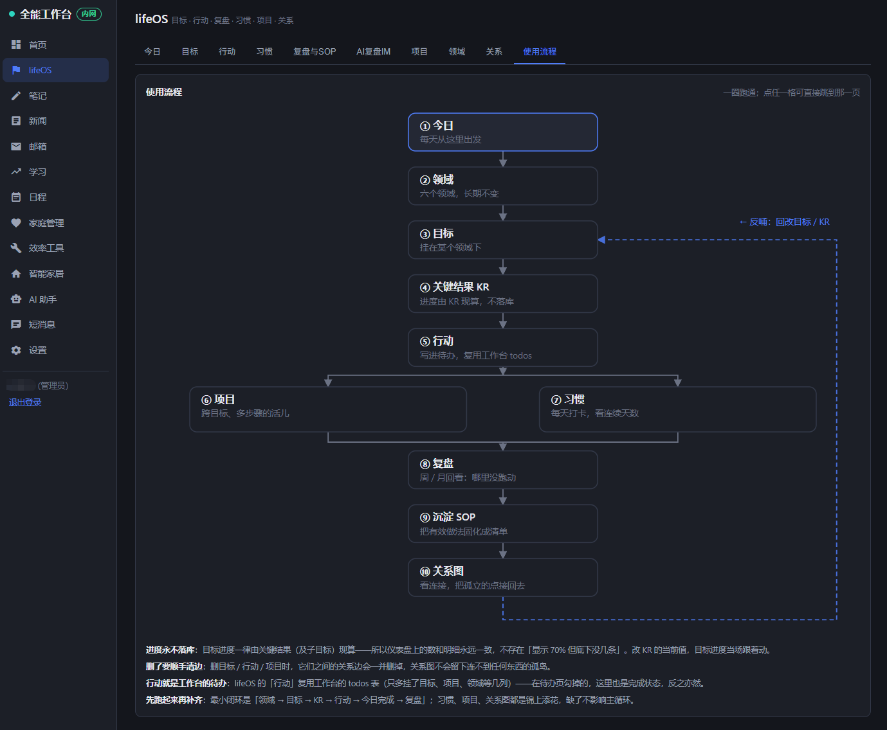

*「使用流程」页：手绘流程图从今日 → 领域 → 目标 → 关键结果（KR）→ 行动（分叉 项目 / 习惯）→ 复盘 → 沉淀 SOP → 关系图，一条虚线反馈回路指回目标；点图上任意格子直达对应页，图下还有四条使用须知。*

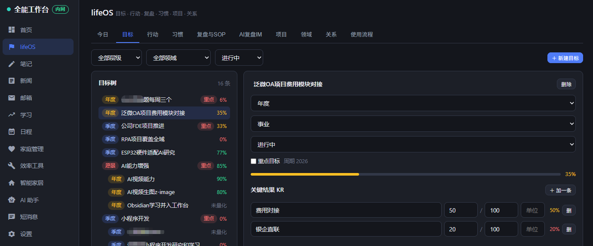

*「目标」页：左侧目标树按层级 / 领域 / 状态筛选，右侧是选中目标的详情——年度 / 事业 / 状态、重点目标勾选，进度条由下面的关键结果（KR）自动算出，KR 支持数值与百分比。*

- **目标树**：愿景 / 年度 / 季度 / 月度共用一棵树，可以层层往下拆。每个目标下挂量化关键结果（KR），目标进度由 KR 自动算出——不落库，改了 KR 立刻一致，不会出现「进度条和明细对不上」。没有 KR 的目标自动取子目标进度的平均值；既没有 KR 也没有子目标则显示「未量化」而不是 0%（「还没定指标」和「一点没做」是两回事）。可以标记「重点目标」，它只出现在今日页，避免每天被几十条目标淹掉。
- **行动**：没有另起一套任务表，而是直接复用工作台已有的待办——新增类型（日常待办 / 主线任务 / 项目任务）、所属目标、所属项目、预估与实耗时长，以及「哪一天的主线」。同一条待办在日程页照旧出现，在 lifeOS 页则能按目标、项目、主线日期来筛。
- **习惯**：每天 / 每周 / 每月三种节奏，打卡记连续天数。同一天重复点只更新计数不会多记一笔（数据库唯一约束兜底），点「撤销」是当天归零，而不是再记一次。
- **复盘与 SOP**：日 / 周 / 月 / 季 / 年五级，一个周期只存一条（同周期再写就是修改）。四段式（做得好 / 做得不好 / 学到了什么 / 下一步动作）外加心情与「对齐度」——后者问的是这段时间做的事跟目标是不是同一个方向，低分往往比做得少更值得停下来看。复盘里写的「下一步动作」可以一键沉淀成 SOP，并记录来源复盘与使用次数。

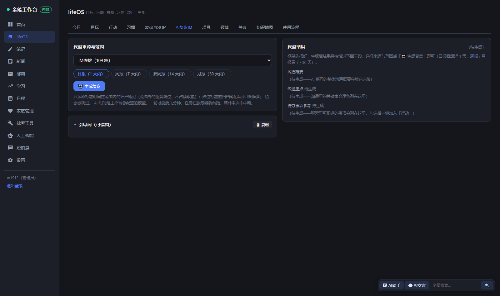

*「AI复盘IM」页：两列布局——左列选来源文件夹与时间范围（生成复盘按钮）、引导词折叠卡（收起时也能一键复制）；右列复盘结果框架常显，沟通概要 / 沟通重点 / 待办事项参考三段。*

- **AI复盘IM**：把「IM 连接」归档的聊天记录交给 AI 自动复盘——选一个笔记文件夹（含全部子文件夹，通常是 IM连接 下某个平台或连接器目录）、选时间范围（1 天 = 日报 / 7 天 = 周报 / 14 天 = 双周报 / 30 天 = 月报），生成沟通概要、沟通重点、待办事项参考三段。生成在服务器后台跑：AI 一轮真实耗时可达数分钟，点「生成复盘」立即返回任务号，页面上有进度条、当前阶段（扫描 / 读取 / AI 生成中…）和过程日志；离开页面任务不中断，回到本页自动接上进度；等不下去可随时取消；在跑时再点一次会接上原任务。AI 用的是工作台「设置 → AI 模型」里总配置的模型；引导词完整可见、可编辑（改完存在你自己浏览器里，随时恢复默认），折叠卡收起时也带常驻复制按钮。读取量优化：归档笔记标题自带最新消息时间（每次同步有新消息都会刷新），范围外的笔记按标题整篇跳过、不读内容。整理出的待办可单条勾选或全选，一键加入「行动」页成为具体行动条目：日待办截止次日，周 / 双周 / 月待办分别截止 7 / 14 / 30 天后（建为日常待办，出处写进描述，之后照常挂目标、改日期）。
- **项目**：工作 / 副业 / 内容 / 产品 / 交付五类，可挂到目标上。删除项目不会连带删掉它下面的行动，只解除绑定。

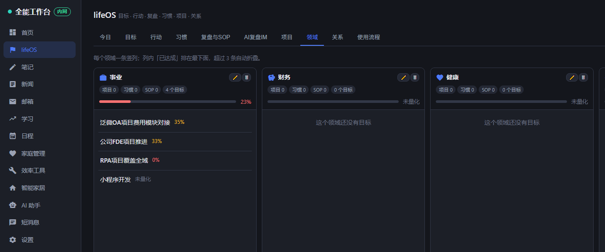

*「领域」页竖列看板：每个领域一张卡片，统计它名下的目标 / 项目 / 习惯 / SOP 数量与平均进度，领域下挂着各自的目标条目与进度；卡片可拖拽排序。*

- **领域**：事业 / 财务 / 健康 / 家庭 / 关系 / 个人成长六个维度（可改名、新增、删除——删之前先拦一道：里面还有目标就一律拒绝），各自给出平均进度与目标、项目、习惯、SOP 的数量，用来看自己是不是长期偏科。领域页是竖列看板，整页自适应宽度；领域内已达成（done）的目标排在最下面，超过 3 条自动折叠，点「＋ 展开其余 N 条」才展开——不让做完的事挡住还在做的。

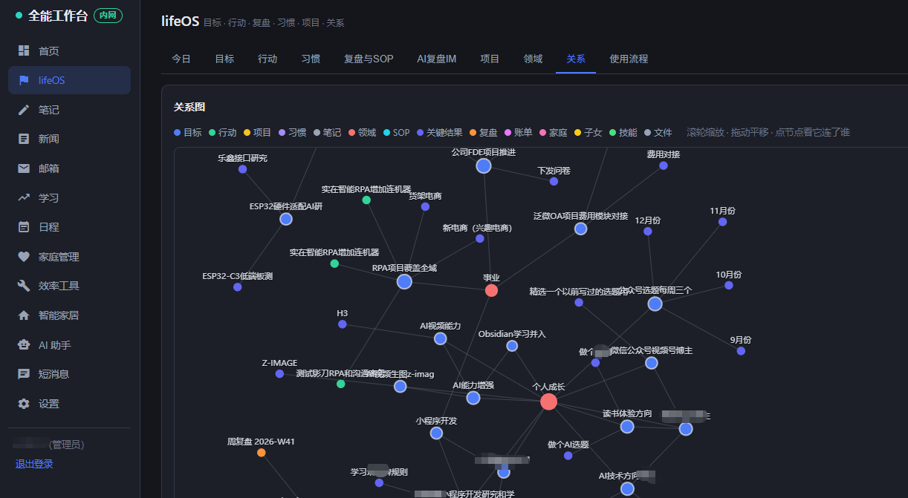

*「关系」页：目标、行动、项目、习惯、笔记、SOP……全部实体与关联画成一张图，按类型着色（图例在顶部），滚轮缩放、拖动平移、点击节点看它连了谁。*

- **关系**：整套系统的地基——目标归属领域、目标拆出子目标、行动支撑目标、项目支撑目标、SOP 派生自复盘……这些关联在创建时自动建立，也可以手动补。关系页把全部关联画成一张图（按类型着色、度数决定大小、整页自适应高宽），孤立的点不出现——它们恰好说明有些东西还被单独搁着、没接到任何目标上。
- **今日**：一屏给出重点目标进度、今日主线、今天到期的待办、习惯打卡、以及「该复盘了」的提醒。

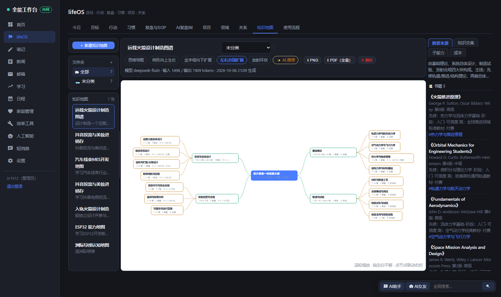

*「知识地图」页：进页自动打开最近制作的一张；左侧地图列表与文件夹，中间画布（多种布局风格可切），工具条元信息显示所用模型与输入 / 输出 token，右栏是数据来源 / 知识交集 / 子能力 / 成本四个视图。*

- **知识地图**：左上输入一句话目标（想获得做什么任务的能力），AI 在服务器后台构建 2~3 层技能树——每个节点带【周期 / 程度 / 成本】三要素，并整理 26 类学习资源（book / article / standard / whitepaper / report / paper / patent / docs / api / opensource / dataset / course / podcast / talk / template / sop / tool / platform / case / retro / internal / archive / expert / community / forum / cert，每条带来源 / 作者 / 版本 / 难度 / 先修 / 适用阶段 / 可信度 / 版权并挂靠技能）。提示词对书籍加权：优先经典教材，实体书加书名号《》。
- **画布**：五种布局风格（思维导图 / 树形向上生长 / 金字塔向下扩展 / 左右分栏扩展 / 放射环状），滚轮缩放、拖拽平移，点节点在右栏过滤定位；有 AI 推荐直达按钮。可导出 PNG 与 PDF——PDF 除主图外还带完整报告页（地图信息 / 子能力 / 成本表 / 数据来源 / 知识交集）。
- **元信息**：工具条上记录每张地图的模型、输入 / 输出 token 与生成时间。
- **知识交集**：把地图的 keywords 与节点名拿去匹配五类已有数据——lifeOS 实体、笔记（不含 IM 归档）、新闻 RSS、邮箱、IM 归档（「IM连接」子树单独成组），命中的点击直接跳回原文。
- **后台任务**：构建在服务器后台跑，进度条与过程日志实时可见，离开页面不中断、回来接着看，可随时取消；AI 输出被截断成非法 JSON 时自动补全闭合括号抢救（尾逗号修复、悬空键值回退、括号栈闭合），救不回就把输出首尾片段与 finish 原因写进任务日志。
- **📋 获得提示词**：把系统内置的构建提示词与你的目标拼成完整文本，一键复制，粘贴到其它 AI 工具里也能生成同类导图。
- 地图可重命名、移动文件夹、删除；进页默认打开最近制作的一张（构建中不抢占画布，空库保持空态）。
- 两条数据规矩：**目标进度永不落库**（存一列就一定会和 KR 明细对不上）；**任何实体被删除时连同它两端的关联一起清掉**，不留指向已删对象的死链。

### 家庭管理


*家庭管理 → 通知：家庭事项登记（富文本，Ctrl+V 可直接粘贴图片与文字混排），可勾选「推送消息给」指定成员。*

- **通知（家庭事项登记）**：富文本编辑，`Ctrl+V` 可直接粘贴图片与文字混排的内容；登记完可勾选推送给指定成员，消息走站内短消息。
- **子女学习**：给孩子下发学习任务，跟进完成情况。
- **家庭人员档案**：记录家庭成员信息，生日同时保留公历与农历，星座、生肖、虚岁自动计算。

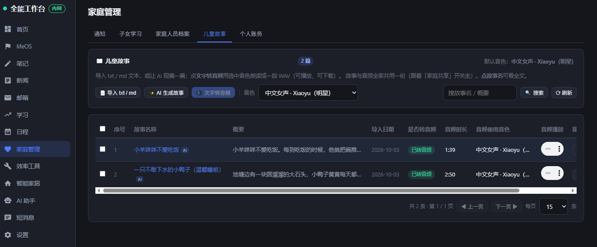

*儿童故事：导入 txt / md 或让 AI 现场生成一篇，选好音色点「文字转音频」；列表依次显示概要、导入日期、是否转音频、时长、使用音色与播放控件。*

- **儿童故事**：导入 txt / md 故事文本，或让 AI 现场编一篇（可选风格，也能让它随机来一个）；选中音色点「文字转音频」，故事就被朗读成一段 WAV。列表依次为序号 / 故事名称 / 概要 / 导入日期 / 是否已转音频 / 音频时长 / 音频使用的音色，带播放控件，已合成音频的多一个下载按钮。默认音色为「中文女声 · Xiaoyu（明星）」，列表默认每页 15 行、可切 5 / 15 / 30 / 50 / 100，故事名与概要都支持模糊搜索，点任意一条弹出全文，删除会连同已合成的音频一起清掉。合成依赖语音引擎（首次需下载约 670MB 模型），音色选择旁直接提供「▶ 启动引擎」按钮，点了就地拉起并依次提示「模型下载中…」「模型加载中…」，就绪后提示「音频引擎已就绪」；引擎未启动时列表照常可用。
- **个人账务**：支付宝账单 CSV 导入，关键词规则与 AI 双通道自动分类，科目 / 预算 / 固定支出管理，看板、排行与年度曲线一屏看清钱花在哪儿。

### 学习


*学习 → 心愿卡。*


*学习 → 打字练习：游戏 / 诗词 / 歌词 / 钢琴四种模式，内容可自定义导入，带赚钱日历。*

- **听写**：由语音引擎播报词条，孩子边听边写，播报语速与内容可调。
- **视频教学**：直接浏览 NAS 上的教学视频目录，播放进度自动记忆，观看时长计入学时记账；播放能力包括 FLV 转封装、本地直连加速、PotPlayer / VLC 外部播放器联动（HEVC、10bit、4K 交给本地播放器硬解）与复制直链。
- **打字练习**：游戏 / 诗词 / 歌词 / 钢琴四种模式，练习内容可自定义导入，配套赚钱日历与兑现登记。
- **练琴**：录音存档，由家长确认有效时长后计入统计。
- **心愿卡**：把想达成的事写下来，与学习进度挂钩。

### 效率工具

本页页签依次为：录音转写 / 智作平台 / 剪贴板 / 快捷启动 / 电脑监控 / 语音配音 / 电子宠物 / 推送任务 / AI 脱敏 / 文件存档 / 全局搜索。不带页签参数打开本页时，默认落在录音转写。


*效率工具 → 智作平台：AI 文案创作子应用，左侧十余个子工具（AI 智能选题 / 文案审查 / 法规库 / 词库管理 / 热门话题 / 我要做爆款 / 成交选题 / 痛点选题 / 脚本创作 / 文案二创 / 爆款拆解 / 文案洗稿 / 爆款仿写），主区是「我要做爆款」的三步表单——行业人设 → 主脚本（教知识 / 晒过程 / 聊观点 / 讲故事）→ 爆款元素。*


*效率工具 → 录音转写：录音保存三节点进度条、转写实时进度（按历史耗时估算）、说话人分离。*


*效率工具 → 电脑监控：每台电脑一行（间隔 / 分辨率 / AI 开关 / 最近截图时间 / 词云 / 张数），下方是截图流，可勾选批量删除。*

- **智作平台**：AI 文案创作子应用，以同源方式嵌入工作台。十余个子工具覆盖从选题、审查、词库到脚本创作、二创、爆款拆解与仿写的完整链路。作为独立子进程运行、只监听本机回环地址，对外仅通过 `/zhizu` 反代访问。
- **录音转写**：双引擎可选——服务器引擎 Whisper large-v3-turbo，适合有算力的服务器 / NAS；客户端引擎 1.5B 量化版（CPU 可跑）或 7B 完整版（需 NVIDIA 显卡），算力落在自己的电脑上，服务器零压力，一键部署包自动安装。支持说话人分离、按历史耗时估算的实时进度条。短消息里的语音消息转写、笔记页的录音笔记复用这套引擎。
- **剪贴板采集**：Windows 代理自动把剪贴板内容推送进工作台，服务端分页与筛选，手机上也能翻到电脑复制过的东西。
- **快捷启动**：常用页面与外部链接的集中入口。
- **电脑监控**：Windows 代理是一个可自安装的 PowerShell 脚本（浏览器下载、双击安装、任务管理器里可见的透明实现），按设定间隔截屏缩放上传。支持每台设备独立配置（间隔 / 分辨率 / AI 分析 / 关键词预警 / 保留天数），预警命中可推送；会话自动合并，AI 概览需要配置视觉模型。
- **语音配音**：MOSS-TTS 引擎一键安装（模型在首次使用时自动下载），输入文本即合成语音；儿童故事页的音色旁也能直接启动同一个引擎。
- **电子宠物**：像素风格的养成玩法，面板内六个子页签——我的宠物 / 领养宠物 / 每日打卡 / 养育记录 / 设置与预览 / 宠物分配。喂养、喂水有冷却与每日上限，打字互动提升好感度，成长圈记录阶段变化；会生病、需要吃药，也可能去世并留下悼词。每日打卡、养育记录、桌面悬浮窗，以及 Windows 桌面宠物。可见性由分配名单决定：谁在「宠物分配」里被勾选，谁页面上才显示这只宠物，管理员也不例外；确实需要代管全部宠物时，在「设置与预览」里打开「管理员显示全部宠物」。旧地址 `/pets`、`/adopt` 会自动跳到本页对应位置。
- **推送任务**：外部系统登记、Skill 引导词任务、Playwright 浏览器自动化抓取、定时执行与结果推送。抓取配方支持登录、点击、开关、表格提取等动作组合。
- **AI 脱敏**：一个**完全本地、纯规则、不调用 AI** 的脱敏能力中心，给工作台里其它要喂 AI 的页面用——把语料里的公司名 / 人名 / 部门 / 群名 / 账号 / 密码 / API KEY / 邮箱 / 手机号 / 身份证等的**原文**在本机换成本轮随机代码（`ORG-7K2M9`、`PER-A1B2C` 这样）再发给 AI，AI 返回后按对照表把代码拼回原词；第三方网关那边看到的从头到尾只有代码。十一个类型可逐个开关，另有**固定关键词表**（一行一个，支持 `词=自定义代码`，写进去的一律替换）、**数值脱敏**开关（勾上会把金额 / 数量也换掉——代价是 AI 没法做加减与比较，可能算错，界面有醒目提示，默认关）。页内四个分区：说明与原理、规则配置、试运行（贴一段文字当场看脱敏结果与「名词 → 代码」对照表）、脱敏历史（每次调用的完整对照表，可按来源筛选 / 单删 / 清空，只存本机库）。**当前接入三处**：lifeOS 的 AI复盘IM（一个「本次喂给 AI 前脱敏」开关 + 运行后展示本轮对照表）、笔记的「AI 总结 / 续写 / 翻译」（点按钮先问「是否先脱敏」，选脱敏就先看对照表、确认后才发给 AI），以及**人工智能 → LLM在线模型**的对话（输入框右侧的【🔒 脱敏】按钮：勾上后本轮发出的内容先换成代码、模型回话时按对照表拼回真名，气泡上会显示「🔒 已脱敏 N 项 / 🔓 已按对照表复原 N 项」，加解密过程另有进度提示；勾上即从对话框右侧延伸出说明框，写明原理、当前规则与本轮「真名 ↔ 代码」对照关系；**Ctrl+回车 = 直接勾选脱敏发送**一个动作完成）。识别是启发式的，人名与公司名可能漏或误——试运行框就是给你当场验规则用的。
- **文件存档**：文件管理，内置零依赖文字提取（docx / xlsx / PDF / 老版 doc / xls），图片型 PDF 交给视觉模型识读；同时作为家庭档案图床使用。
- **全局搜索**：跨笔记、待办、日程、家庭事项、子女任务、学习记录、剪贴板、新闻、邮件的全文搜索。页面右下角常驻悬浮搜索框，空输入点击直达搜索页，带词搜索自动执行。

### 人工智能

本页页签依次为：米家 / 数字人 / LLM在线模型 / 智能板 / Agent 红绿灯 / 米家设置 / 米家参数翻译 / 视频中心。

页面右下角（全局搜索框前）常驻两个悬浮直达按钮：**AI助手**（跳到 LLM在线模型页签）与 **AI男友 / AI女友 / AI萌宠**（标签随数字人默认人物类型变化，点击展开数字人悬浮窗）。旧地址 `/#/ai` 自动重定向到 `/#/smart-home?tab=llm`，从 AI 助手独立页迁移过来的账号授权也会自动平移（原本只开 AI 页的成员，迁移后恰好只开人工智能页的 LLM在线模型页签，不会被放宽也不会落空）。

#### 米家


*米家：家庭下拉 + 设备卡片按房间铺排（在线状态、温度 / 空气质量直显、父设备角标），卡片上直接圆形开关。*

通过小米账号 OAuth2 官方授权（与 Home Assistant 官方集成同一通道）接入米家云端：

- **绑定**：生成授权二维码（或用电脑浏览器直接打开授权页），小米账号确认后粘贴回跳地址完成绑定。访问令牌 AES-256-GCM 加密存储，到期自动续期，解绑即时失效。
- **设备总览**：家庭 → 房间 → 设备卡片的层级铺排，卡片上显示在线状态、温湿度与空气质量读数，父设备与分路开关各归各位；有开关能力的设备卡片上直接提供圆形开关，操作乐观更新、失败自动回读校正。
- **设备详情**：完整展开 MIoT 规范能力（服务 / 属性 / 动作 / 事件），属性可读可写（布尔开关、枚举下拉、数值范围、字符串），动作可带参执行。
- **纯云端调用**，不依赖局域网；控制的是账号下已在米家 App 绑定的成品设备。

#### 数字人（AI 男友 / 女友 / 萌宠）

基于 Vivix 实时数字人接口的陪伴型角色模块。页签内分五个子页：数字人界面 / 聊天记录 / 设置 / 角色设置 / 智能家居控制。


*数字人界面：实时对话画面（画面比例随人设与直播流真实分辨率自适应），下方角色卡片点选即切换默认人物，右下角悬浮窗跟随的就是这位默认人物。*

- **数字人界面**：点「开始实时对话」后由服务端调用 Vivix 建会话（API Key 只在服务端，浏览器拿不到），浏览器通过 WSS 控制通道收发指令、通过 TRTC 拉取实时音视频流。开始对话即默认打开麦克风（🎤 可手动关开）——开始对话与开麦是一个动作，不用分两次点。说话内容经 Vivix ASR 转成文字气泡，显示在对话区（主界面与悬浮窗同步），并收录进「聊天记录」；对方的回复同样以气泡呈现。转写不额外消耗积分（ASR 本来就是实时会话内一直在跑的能力，这里只是把结果推给客户端）。画布比例随人设（16:9 / 9:16 / 1:1），直播时按流的真实分辨率自适应、contain 呈现不裁切。不想开视频也可以直接在输入框打字——文字试聊走工作台已配置的 AI，系统提示词由人设引导表单自动组装。**打字也能控设备**：像「打开客厅书架台灯」「帮我关掉台灯」这类指令由工作台**在服务端先认出来**，直接落到与智能板同一条米家链路上执行，回复的就是执行回执本身（真的开了才说开了，没找到设备 / 重名多台 / 设备离线都会如实说明并给出候选，绝不编一句「已经打开了」）。**实时对话里也一样**（v1.13.3）：实时会话的对话内容走服务商通道、不经过工作台服务器，所以由浏览器在发送前先问一句工作台「这是不是设备指令」——是就当场执行、再把**真实结果**交给实时会话照实念（打字这一路原句不发出去，只有一句）；开麦说话被转成文字后同样真去执行并把结果补回对话。人设里另加一条硬规矩：设备由工作台系统控制，不许声称自己已经打开了什么。断连 90 秒自动关会话兜底；每角色在服务端只保持一个会话（悬浮窗顶掉面板里的会话）。
- **聊天记录**：左侧人物选择（头像 + 名称），右侧气泡窗口浏览全部历史；主界面、悬浮窗、文字试聊的消息都落库在这里。

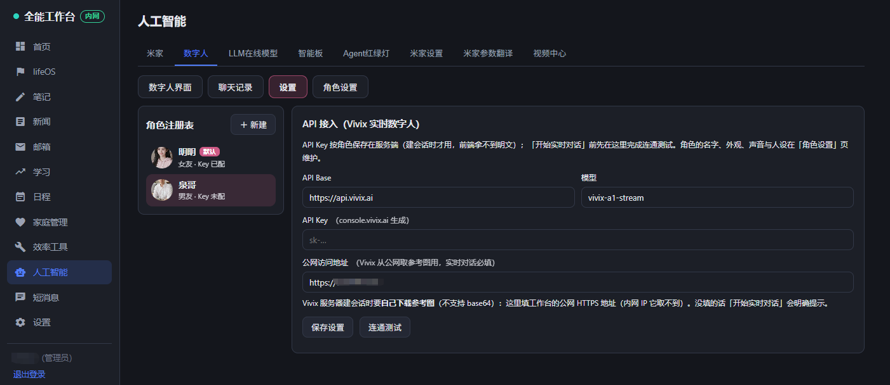

*数字人 → 设置：角色注册表与 API 接入卡片——API Base / 模型 / API Key / 公网访问地址集中在这里，已保存的 Key 只显示已配置状态。*

- **设置**：只管 API 接入——API Base / 模型 / API Key / 公网访问地址（参考图等公网资源从这个地址下发），以及两个探测按钮：「连通测试」直连 `GET /v1/models`（轻量，不建会话不烧额度）；「💰 查余额」查 `GET /v1/balance`，A / W 两档额度分项一起亮出。
- **角色设置**：角色注册表（可建多位，类型男友 / 女友 / 宠物）；固定预览（叠放卡片默认看最前面那张参考图，点左半边翻回、点右半边翻向下一张）；参考图每角色最多 8 张（首图即开场白载体，建会话取前 5 张，可排序、可写构图描述）；基本信息含 Qwen Audio 九音色任选；**人设引导构建**把官方口径的四处协同拆成平铺表单：人设一句话、口语短句（单句字数上限）、口头语、对用户的称呼、场景（服装 / 光线 / 背景——定格在首图里）、画面比例与分辨率（16:9 + 720p 为最高档）、固定平视机位 / 镜头跟平移但构图锁定、景别与人物占比、允许的动作、禁止的动作、开场白、可打断，另有预留的「其他引导设置」；**会话 JSON 预览**一键查看服务端组装的完整建会话载荷。
- **悬浮窗**：右下角「AI女友」按钮（标签随默认人物类型显示 AI男友 / AI女友 / AI萌宠）在页面最右侧展开手机模型浮层——打开即自动建会话拉流并开麦；竖屏画面、默认宽 460px 可自由拉宽（宽度记忆），对话区固定两行高度、内部滚动，不挤占视频画面，也不遮住右下角搜索框。
- **智能家居控制**：在数字人设置里直接管「人工智能 → 米家」那张设备表——控制通道（直接米家 / 智能屏转述二选一）、智能屏备用通道的播放与执行点位（可自动探测、可试播试执行）、可控设备一览（家庭过滤下拉、逐台开关、语音别名登记）。对话里的「打开 / 关闭 某某」文字指令也走这里这本账（服务端识别 → 直连米家，回复即回执；实时对话里的打字与说话同样受理）；闲聊与疑问句不会被误当成指令执行。这一页**与「智能板 → 语音控米家」是同一份配置**（控制通道 / 智能屏点位 / 家庭过滤 / 设备别名都存一份），两边任一处改完另一处刷新即见；按需求它**不含任何板子相关内容**（桥接地址、桥接密钥、编译烧录、固件、串口、装机向导一律没有），也不依赖数字人角色——一个角色都没建时照样能用。
- 首次进入自动创建示例人物（默认音色跟随音色表首位，不写死具体音色）并附 8 张参考图；API Key 明文只存租户库，接口返回一律只回「已配置」布尔。
- 已知边界：Vivix 免费档同一 workspace 并发为 1（同时只能有一个实时会话，关闭后异步释放约需几十秒，连开两个会撞 workspace concurrency limit）；个别音色可能在服务端单独损坏——报 505001 / AUDIO_PREPARE_UPSTREAM_ERROR 时先到角色设置换个音色再试，与麦克风无关。

#### LLM在线模型

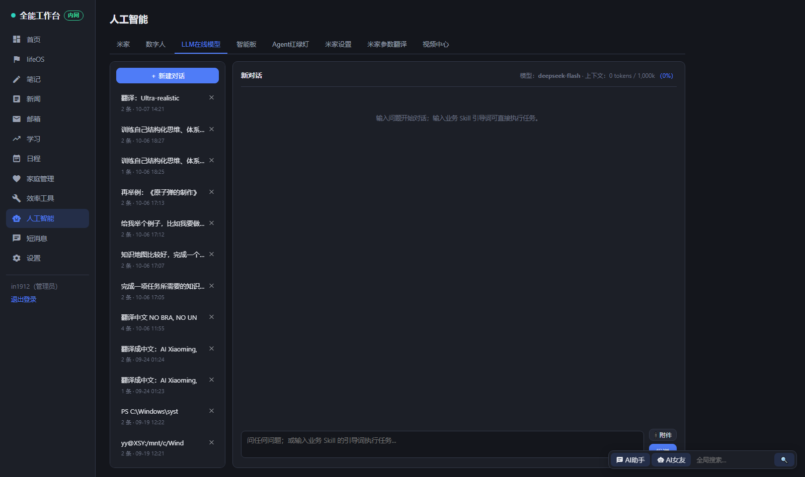

*LLM在线模型：左侧「新建对话」与会话历史列表（各条带条数、时间、可删除），右侧对话区标题行显示当前模型与上下文 token 用量，底部输入框带附件上传；右下角是 AI助手 / AI女友 悬浮按钮与全局搜索框。*

原独立页「AI 助手」，现为人工智能页的一个页签（右下角「AI助手」悬浮按钮与旧地址 `/#/ai` 都直达这里）：

- 接入任意 **OpenAI 兼容接口**：DeepSeek、通义千问、Kimi、OpenAI 等，模型名、API 地址、API Key 在设置页统一配置，可单独配置视觉模型。
- 多会话管理：左侧历史列表可随时新建、删除；对话区标题行实时显示当前模型与上下文 token 占用。
- 支持上传附件（文档 / 图片），图片与扫描件交给视觉模型处理。
- **发送前脱敏**：输入框右侧三个等大按钮——📎 附件 / 🔒 脱敏 / 回传。勾上【脱敏】后，这一轮发出去的内容会先在本机把公司名 / 人名 / 部门 / 群名 / 账号 / 密码 / API KEY 等换成随机代码，在线模型看到的是代码；它回话时再按对照表**复原成真名**，所以聊天框里看到的始终是真实名称。加解密过程中对话区有进度提示（「🔒 已脱敏 N 项，正在发送给在线模型…」→「🔓 正在按对照表复原…」），每条消息下面标注这一轮脱敏 / 复原了多少项。
- **右侧脱敏功能框**：勾上【脱敏】即从对话右侧展开（利用原先 1200px 版心之外的空白，窗口够宽时对话区尺寸一分不让），内含三块——说明与原理（含「图片附件无法脱敏、要保密请用文字发」的如实提醒）、当前规则（各类型开关、数值脱敏、固定关键词条数，可跳「效率工具 → AI 脱敏」修改）、本轮对照关系（真名 ↔ 代码逐条列出）。再点一次按钮或框上的 ✕ 收起。
- **Ctrl+回车 = 直接脱敏发送**：不必先点按钮，一个快捷键等于「勾上脱敏 + 回传」。
- 规则本身在「效率工具 → AI 脱敏」里配置；若那边总开关关着，这里会**如实提示**「本轮未脱敏、原样发送」，不会假装脱敏。
- 配置完成后，新闻摘要、笔记总结、学习复盘、账务分类、电脑监控 AI 概览等模块的智能能力一并启用。

#### 智能板（小智 Korvo2V3 语音板）


*智能板：装机向导（驱动 / 烧录 / 配网 / 控制台绑定 / 唤醒测试）、唤醒词在线改一键编译烧录、语音控米家。*

把一块 ESP32-S3-Korvo-2-V3 小智 AI 语音板从零到「说话控全家」的完整链路收进工作台：

- **装机向导**：① CH343 串口驱动包与串口日志脚本下载 → ② 固件烧录（下载本地烧录工具包，解压双击即用；或在线上编译烧录、下载镜像手动 esptool）→ ③ 配网（连上板子热点后新窗口直达板端配网页 `192.168.4.1`）→ ④ 小智控制台设备绑定（新窗口直达 xiaozhi.me）→ ⑤ 唤醒测试话术，一步步照做即可。
- **唤醒词在线改**：填拼音、显示名与灵敏度阈值（1–99，越小越灵敏），点「编译并烧录」一键完成——服务端拉起 ESP-IDF 构建链，自动写入板级 `config.json`，烧录前强制校验芯片型号为 ESP32-S3 以防烧错板子，随后以 921600 波特率烧录，进度与日志实时滚动。产物镜像随构建归档，可供其它电脑下载手动烧录。没有 ESP-IDF 工具链的环境（例如 NAS 容器）会自动降级为「文档 + 工具下载」模式，并支持填写构建机地址，直接在这台机器上代理下载编译好的固件镜像与可复制的 esptool 烧录命令。
- **语音控米家**：固件内注册 `list_devices / control_device / exec_text` 三个工具，云端 AI 解析语音后经板子回连工作台的桥接接口（免登录白名单 + 桥接密钥，可一键轮换）驱动米家设备——对着板子说「把客厅灯打开」即可。双通道可选：直接 MIoT（默认，开关类直达并有回执）与小爱智能屏转述（自然语言交给小爱解析，可覆盖「空调调到 26 度」这类复杂操作，附试播 / 试执行按钮）。可控设备一览与米家页同源，多路开关的父设备以圆角标签标注，各分路独立可控；支持默认家庭下拉（记忆选择）、逐台快捷开关与语音别名——登记别名后只认别名，两台重名设备给其中一台起别名即可消歧，喊被顶替的本名会得到新叫法的提示。
- **视频对话**：一个按钮同时开启实时画面（MJPEG 流，经工作台中转，外网打开也能看）与板子对话模式（用板子的麦克风和扬声器说话与回应），「结束」一键同收；两边状态分别可见，部分失败时再点一次按钮只补缺的那一边。板子 IP 由轮询自动登记，页面显示在线状态。
- **屏幕四个按钮**：板子屏幕可触摸操作——右下角常驻一个「功能」按钮，点开是铺满屏幕的四个大按钮（再点空白处收起，不挡聊天文字）：**聆听**（不喊唤醒词直接收音听指令）、**关闭**（立刻停止播放与动作）、**AI**（把这句话直接转给工作台里配置的 agent，由板子念出回答）、**测试**（把接入点连接状态、agent 连通性与查来的本地天气组装成一条消息，按面板里所选通道发出）。面板里可设置测试按钮走飞书还是钉钉，选了哪条就只发哪条，那条没配好会在板子上如实报错，不会改走另一条。


*智能板 → 对话记录：与板子的全部对话以聊天窗口形式浏览（左=应答，右=用户语音），默认滚到最新一段，向上滚到顶自动加载更早的内容。*

- **对话记录**：与板子的全部对话自动存入工作台——固件把云端识别出的用户语音和每句应答攒批上报，页面以聊天窗口形式浏览（左=应答，右=用户语音），默认滚到最新一段，向上滚到顶自动加载更早的内容（每次约 3 屏，保留最近 5000 条）。
- **摄像头相册**：对板子说「拍张照存相册」即拍照上传；页面按钮也可主动触发（板子每约 25 秒轮询一次指令）。照片点击放大、滚轮缩放、双击复位、ESC 关闭，管理员可删除，自动保留最近 200 张。

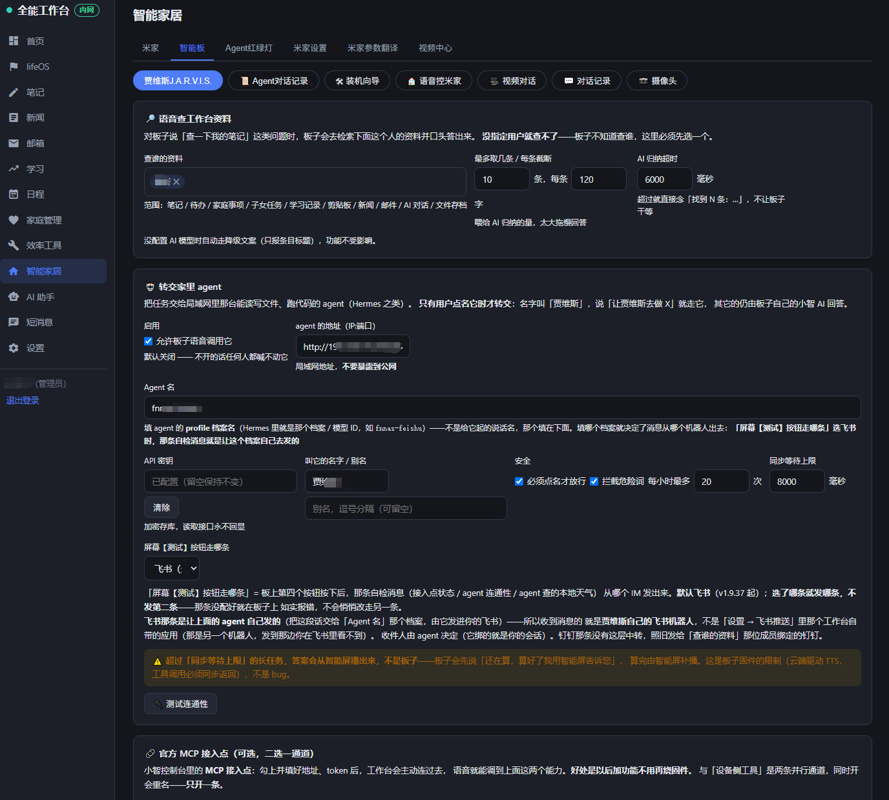

*智能板页的贾维斯设置区：「语音查工作台资料」（查谁的资料 / 最多取几条 / 每条截断 / AI 归纳超时）与「转交家里 agent」（启用开关、agent 地址）等配置集中在此；顶部快捷入口直达装机向导、语音控米家、视频对话、对话记录与摄像头。*

- **贾维斯 J.A.R.V.I.S.**：让板子除了控设备，还能查资料、替你办事。
  - **语音查工作台资料**：先指定一个成员（不指定就没法查——板子不知道查谁），之后说「查一下我的笔记」「装修花了多少钱」，它会去检索这个人的笔记、待办、日程、家庭事项、子女任务、学习记录、剪贴板、新闻、邮件、账务、AI 对话与文件存档（复用全局搜索同一套检索），再用 AI 归纳成一句话念出来。检索天然支持「今天 / 明天 / 本周 / 本月 / 今年 / 最近」这类时间范围，问「本月有几条日程」的条数也按范围精确统计；问练琴时长会按说话里点名的成员回答有效时长与次数，口径与学习页一致。没配 AI 模型也能用，自动降级成只报条目名称。问自己的笔记、待办、日程、邮件、文件时不会转交给家里的 agent——它看不到工作台数据库。
  - **转交家里的 agent**：把局域网里那台能读写文件、跑代码的 agent（如 Hermes）接进来，并给它起个名字（默认「贾维斯」，可加别名）。只有明确点名它时才转交，其它问题仍由板子自己的小智 AI 回答。地址（填 `IP:端口` 即可，`/v1` 段自动补全）、Agent 名（agent 的 profile 档案名）与密钥都在面板里配置，密钥加密存储、读取接口永不回显。点「测试连通性」不通时会把它实际试过的地址一并显示出来，便于对地址。安全闸门：默认关闭、必须点名、拦截危险动词（删除 / 格式化 / 关机 / 重启 / 执行等）、按小时限流、全程留痕。超过同步等待上限的长任务，答案会由智能屏补播而不是板子念出。
  - **官方 MCP 接入点**：在小智控制台建一个 MCP 接入点，把地址与 token 填进来，工作台会主动连过去、以 MCP 服务端身份对外提供上面两个能力。好处是以后加功能、改 agent 名字都不用再烧录固件。地址与 token 分两个框填写，token 拼进地址会被拒绝保存。页面有连接状态灯。
  - **Agent 对话记录**：转交流水单独成页，方便排障。列表默认每页 20 行、可前后翻页，每页可选 5 / 10 / 20 / 30 / 50 / 100；支持日期范围（含当天整天）、状态类型（已办 / 已拦 / 出错）、语音内容、反馈内容四项模糊筛选，筛选与翻页都在服务端完成。
  - 遇到回答质量不理想的场景，服务会自动体检并降级——宁可少些润色，也不会把「说明书」念给用户听。
  - **权限**：页签归人工智能页；桥接密钥、配置保存、构建烧录、串口探测、删除照片均限管理员；快捷开关与请求拍照登录即可。固件桥接地址建议填 NAS 内网地址，板子与工作台同局域网时最快最稳。

#### Agent 红绿灯


*Agent 红绿灯：ESP32-C3 三色灯 = 九家 AI agent 的状态指示灯，面板内分「功能介绍 / 下载安装包 / 安装步骤」三段。*

- 一块 ESP32-C3 三色灯，作为九家 AI agent 的状态指示灯：Claude / Codex / WorkBuddy / CodeBuddy / Cursor / dsh / Hermes / Gemini / Qwen，通过蓝牙 BLE 连接。
- 面板分三段：**功能介绍**（示例图、灯效对照表、九家兼容说明）/ **下载安装包**（Windows 与 macOS 双打包，附子文件清单）/ **安装步骤**（刷板子（下载同一个本地烧录工具包即可，见下）→ 电脑钩子 → 蓝牙配对，附参考文档）。

#### 本地烧录工具包（在电脑上直接烧板子）

智能板与 Agent 红绿灯的烧录页都提供「⬇ 下载本地烧录工具包」，两边共用同一个包——下一次、两个设备都能烧：

- **包内容**：启动脚本、烧录网页、esptool 烧录引擎（依赖已内联，运行期零外网）、两个设备的固件、CH343 串口驱动，以及写清楚每一步的说明文件。
- **怎么用**：解压 → 双击 `启动烧录.cmd` → 浏览器自动打开烧录页 → 选设备、选串口、点开始。不需要装 Python、不需要装驱动框架、不需要管理员权限（Windows 上第一次插板子按提示装包内 CH343 驱动即可）。
- **为什么是网页**：浏览器的串口接口（Web Serial）只允许在安全上下文里使用，本地页面打不开串口，所以启动脚本会在本机 `127.0.0.1` 上起一个只有本机能访问的小服务器，再把页面开出来——串口列表只列你主动选中的那个口，页面不会自己去扫。
- **智能板（ESP32-S3）**：按分区偏移分段烧写，不碰 NVS 分区，配网信息与设备绑定都保留（老式「写入合并镜像到 0x0」的做法会把 NVS 一起清掉，每烧一次就要重新配网，工具包不做这件事）；烧前强制校验芯片型号，插错了会当场拦下。
- **Agent 红绿灯（ESP32-C3）**：一步到位——先烧 MicroPython 固件，再通过串口把 `main.py` 写进板子文件系统，不用另装 Python / mpremote。
- **固件开箱即用**：包里的智能板固件是预编译模板，下载那一刻服务端会把本应用的访问地址与桥接密钥字节级写进固件（并重算镜像校验值），所以板子烧完就直接连回这台 NAS；从局域网直连端口下载时地址即当前地址，从飞牛桌面入口下载时自动换算成局域网直连地址（板子的请求过不了 NAS 网关的登录校验）。
- 改了唤醒词等配置才需要走「构建机编译」那条高级路线；老的 `write-flash 0x0 merged-binary.bin` 做法保留在折叠区，并明确标注副作用。

#### 米家设置 / 米家参数翻译

- **米家设置**：小米账号的绑定与解绑。
- **米家参数翻译**：内置静态词典加服务端设备实测词典，共 1300+ 词条，设备详情页的参数名与枚举值自动中文化并括注英文原文，可搜索。

#### 视频中心


*视频中心：左目录树 + 右播放区，视频下方是播放历史（时间 / 文件夹 / 文件名 / 完整路径），外部播放器按钮在历史之下。*

「学习 → 视频教学」的精简版，去掉学年学科、注意力点检、文档预览与学时记账，只留下浏览与播放：

- 左目录树 + 右播放区，直接浏览播放 NAS 里的视频与音频（mp4 · flv · webm · mp3 等），按人记忆进度断点续播。
- 保留视频教学那套播放能力：FLV 转封装、本地直连加速、PotPlayer / VLC 外部播放器联动、复制直链。联动注册脚本与视频教学共用同一份，装过一次两个页面都能用。
- **播放历史**：时间 / 所在文件夹 / 文件名 / 完整路径，倒序排列，默认每页 5 条可翻页、每页量可改为 5 / 10 / 15 / 30 / 50，点任意一行即重新打开。
- **文件夹内循环播放**：播完自动接同文件夹的下一个，末尾回到开头（不含子文件夹），标题栏有开关，默认开启，选择在本地记住。
- 目录在「设置 → 智能家居视频路径」配置（仅管理员），与视频教学目录各自独立。

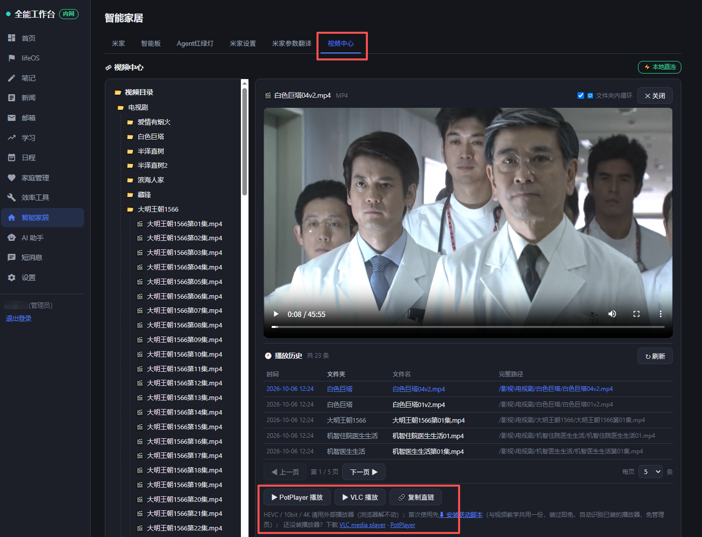

*NAS 里的视频在网页里直接读取播放；底部的 PotPlayer 播放 / VLC 播放 / 复制直链按钮把播放交给外部播放器（4K、HEVC 交给本地硬解），标题栏还有「文件夹内循环」开关与「本地直连」标识。*

### 短消息


*短消息：成员间气泡会话、语音消息、电脑桌面通知；右下角常驻未读弹窗。*

- **站内消息**：成员之间以气泡会话沟通，右下角常驻未读弹窗，新消息不会错过。
- **语音消息**：最长录 60 秒，微信式气泡可反复播放；发送后自动转写成文字显示在气泡下方，失败时可点「点我转文字」手动重试，支持群发。转写优先使用 Whisper large-v3-turbo，未安装时回退 VibeVoice，并在文字下方小字标注所用模型与耗时。
- **电脑桌面通知**：短消息页底部下载批处理，双击即装（无需管理员权限，随系统自启）——有新消息从屏幕右下角弹窗，点击弹窗任意位置即标记已读并自动打开消息页。脚本按打开工作台时的网络路径内嵌地址，内网装走内网、外网装走外网；语音消息弹窗可自动播放声音；安装与卸载脚本都在同一处下载。
- **钉钉机器人收发**，以及模块事项的自动推送（新邮件提醒也走这条通道）。

### 设置

本页页签依次为：常规设置 / SSL 自签名 / 升级管理 / 飞牛应用 / 登录日志 / 前端错误 / 用户管理 / 多平台（多数仅管理员可见）。

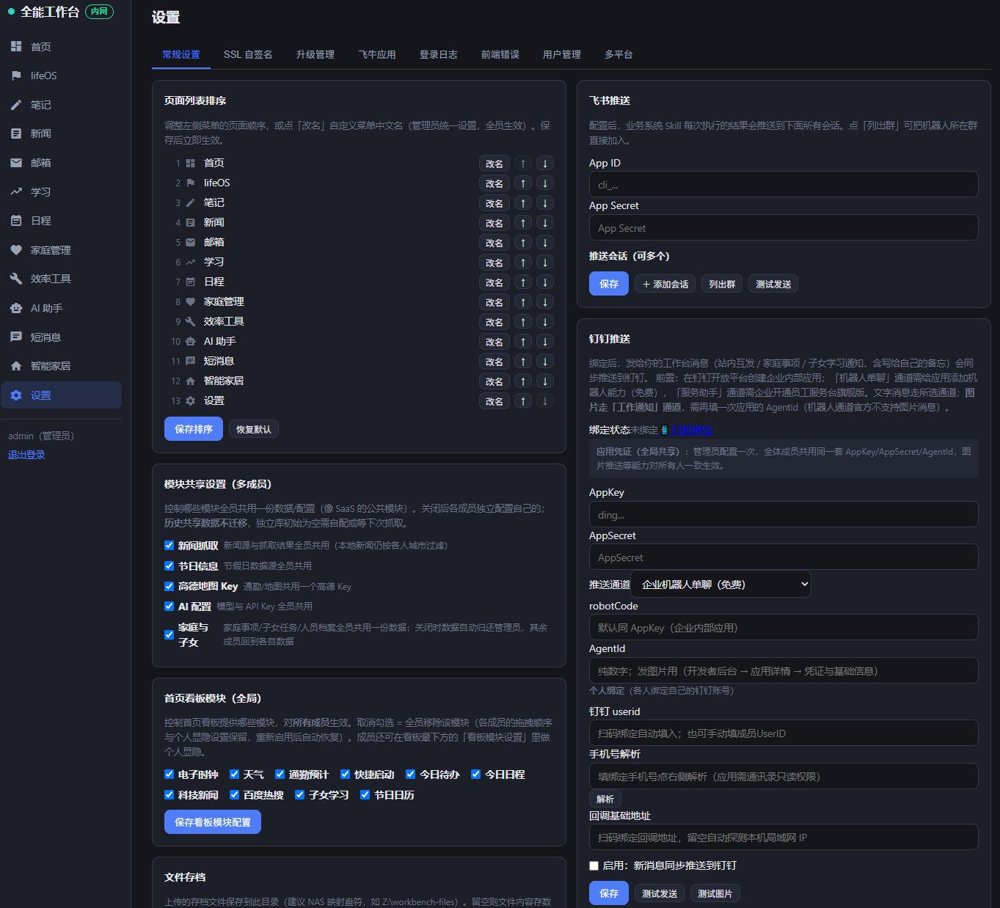

*设置 → 常规设置按分区卡片铺开：页面列表排序、模块共享设置、首页看板模块、文件存档与飞书 / 钉钉推送渠道等；已保存的凭证只显示脱敏前缀，不回明文。*

- **常规设置**：系统名称（浏览器标题、登录页、全站即时生效）、页面排序与改名、天气城市、通勤、新闻源、AI 与视觉模型、钉钉 / 飞书推送、信用卡账单日、模块共享开关、智能家居视频路径。
- **SSL 自签名**：为局域网 HTTPS 访问签发证书，支持 SAN 多域名 / IP。
- **升级管理**：系统内差分升级，见下文。
- **飞牛应用**：fpk 在线下载与安装步骤。
- **登录日志**：登录记录留痕。
- **前端错误**：前端异常自动上报并环形存储，管理员可查可清，无需 SSH 也能远程排障。
- **用户管理**：成员账号，页面级 + 页签级双层授权。
- **多平台**：查看各访问通道与地址。

### 定时任务

新闻抓取、Skill 定时、日程提醒巡检、邮箱按账号独立轮询、每日默认待办生成（每天 06:00）、每日笔记自动创建（每天 05:00，需在笔记设置里打开；服务重启时会补跑当天一次）、SSL 到期检查、每周数据清理、IM 连接器按各自时点同步等任务在后台自动运行，无需人工触发。

## 安装部署

### Windows（推荐）

1. 安装 [Node.js 22 LTS](https://nodejs.org)（版本必须 22.5 以上）。
2. 把项目解压到任意位置（路径不带空格更省心）。
3. 双击 `start.bat`：首次运行自动安装依赖并启动，浏览器打开 <http://localhost:3000>。
4. 用 `admin` / `admin123` 登录，立即到「设置 → 账号与安全」修改默认密码。

命令行方式：

```bash
npm install
node --no-warnings server/index.js
```

### macOS / Linux

```bash
npm install
npm run build:web   # 首次运行或前端有更新时构建
npm start           # http://localhost:3000
```

macOS 下也可直接双击 `start.command` 启动。

### Docker

```bash
docker compose up -d --build
```

- `restart: always`，开机自启；数据落在宿主 `./data` 卷，升级或重建容器都不丢。
- 若在设置里配置了 NAS 目录（视频教学根目录、附件存储等），容器部署需填容器内路径（如 `/vol1/media`），并在 compose 里加对应的卷映射。
- 也可以执行 `bash pack-deploy.sh` 生成含源码与数据目录的全量部署包，上传服务器使用。

### 飞牛 fnOS NAS

按[飞牛应用开放平台](https://developer.fnnas.com/)规范打包的官方形态应用，在 fnOS 桌面应用中心一键安装 fpk：

- **统一网关嵌入**：桌面入口走 `https://NAS域名/app/qgworkbench`，复用 NAS 域名与 HTTPS，应用监听 `app.sock` Unix Socket。
- **NAS 账号免登**：网关校验 NAS 登录态后注入可信用户头，工作台按用户名自动开号（NAS 管理员对应工作台 admin，普通成员对应普通账号），从桌面点开即用。
- **局域网直连**：同时监听 **7777** 端口，访问 `http://NAS内网IP:7777` 走工作台自己的账号密码。
- **fpk 获取**：在工作台「设置 → 飞牛应用」页签直接下载安装包——下载地址自动跟随当前访问通道（内网浏览器打开走内网、外网域名打开走外网），页面附安装步骤。


*设置 → 飞牛应用：一键下载 fnOS 应用 fpk 安装包（下载地址自动跟随当前访问通道），下方是安装步骤与形式说明。*

- **数据自治**：全部数据在 `@appdata/qgworkbench/data/`，应用中心升级不丢；安装向导可选初始管理员与 NAS 成员默认权限。

另有一个从工作台里独立出来的单模块应用「JARVIS」（应用名 `jarvis`，端口 **7778**，源码同一仓库、服务端 `WB_MODE=smarthome` 模式分支；详细安装与排障见 `fnos-sh/README-FNOS.md`）：

- **只带智能家居**：侧栏直接列出米家 / 智能板 / Agent 红绿灯 / 米家设置 / 米家参数翻译 / 视频中心六个模块，各模块内部子页签原样保留；不含邮箱 / 笔记 / 账务 / 学习等工作台模块（服务端也一并裁掉——免登的应用里那些接口返回 404，不会因为没登录页就把数据敞开）。
- **没有登录页**：从飞牛桌面点开就用，局域网直连 `http://NAS内网IP:7778` 也直接进；数据完全独立一份（`@appdata/jarvis/`），米家绑定与智能板配置在新应用里重新配一次。
- **装好即能烧板子**：固件随应用分发，智能板 / 红绿灯烧录页的「本地烧录工具包」照旧可用（见上文）。
- ⚠️ 因为免登，请只在自家内网暴露 7778 端口，不要映射到公网。

自行构建 fpk：

```bash
node fnos/build-fpk.mjs   # 生成打包源
fnpack build              # 打包
python fnos/fix-fpk-perms.py   # Windows 打包器权限位修复
```

「智能家居」单模块应用（本机没有 `fnpack` 时走 bsdtar 复刻链，外层结构与官方包逐条目一致）：

```bash
npm run build:web:sh                       # 前端 → web/dist-sh/<时间戳>
node fnos-sh/build-fpk.mjs                 # 装配载荷（生产依赖用 --node-modules 指定现成目录可省一次 npm ci）
python Logs/build-fpk-sh.py                # → server/fnos-sh/智能家居-飞牛应用-<版本>.fpk
```

## 首次配置

1. **系统名称**：设置 → 系统名称，浏览器标题、登录页与全站即时生效。
2. **天气**：设置 → 输入城市名 →「保存并定位城市」。内置全国地级市与知名县级市坐标库，国内城市离线即存、无需 Key、无需服务器访问外网；区县与境外城市自动走在线定位兜底。
3. **AI**（可选但强烈建议）：设置 → 填模型名称、API 地址、API Key。任意 OpenAI 兼容服务均可；配置后新闻摘要、笔记总结、学习复盘、LLM在线模型、账务分类、电脑监控 AI 概览等全部启用。
4. **邮箱**：邮箱页 → 最后一个页签「邮箱设置」→ 添加账号（IMAP 服务器、账号、授权码；发信再配 SMTP），可添加多个。提醒开关、关键词标签、附件存储目录也在这里。
5. **新闻源**：内置实测可用的科技与生活 RSS；「本地」分类建议替换为你所在城市的 RSS 源。
6. **成员**：设置 → 用户管理（仅管理员），添加账号并勾选可访问的页面与页签。

## 访问方式

- **换端口**：设置环境变量 `PORT`（例如 `set PORT=3100` 后再运行 `start.bat`）。
- **局域网**：默认监听 `0.0.0.0`，手机、平板连同一 WiFi 后访问 `http://<电脑IP>:3000`，系统内「分享访问」页可直接查看本机 IP。Windows 首次访问需在防火墙放行端口。
- **外网**：自行配置内网穿透或反向代理域名。内置 SSL 自签名证书工具（设置 → SSL 证书）可为局域网 HTTPS 访问签发证书，含 SAN 多域名 / IP。

## 数据与备份

| 部署方式 | 数据位置 |
|---------|---------|
| 本地直跑 | `data/workbench.sqlite`（主库）+ `data/tenant-*.sqlite`（各成员租户库） |
| Docker | 宿主 `./data` 卷（容器内 `/data`） |
| 飞牛 fnOS 应用 | `@appdata/qgworkbench/data/`（应用中心升级不丢） |

- **备份**：复制整个 `data/` 目录，外加智作平台的 `zhizu/data/`。
- **恢复**：把目录拷回原位即可。
- **完全重置**：停服务 → 删除 `data/` → 重启（账号回到默认 `admin` / `admin123`）。
- **注意**：不要把 `data/` 放在云同步盘（OneDrive、坚果云、Synology Drive 等）目录下——同步锁文件会导致 SQLite 写入失败。需要自定义位置时用 `DATA_DIR` 环境变量指向非同步目录。

## 多成员与权限

系统支持类 SaaS 的多成员使用，管理员建好账号后，每个成员是一个独立的租户：

- **完全隔离**：笔记、待办、日程、邮箱配置、文件、AI 对话、账务、学习、家庭档案、推送任务与 Skill、看板布局等，成员之间互不可见。
- **可共享模块**（由管理员开关控制）：新闻抓取、节日、地图 Key、AI 配置、家庭与子女——开启共享时管理员统一配置，全员同享。
- **双层授权**：页面级 + 页签级。例如只开邮箱的通讯录、只开效率工具的推送任务；授权按表格勾选，受限功能默认关闭，需要显式授予。
- **页面排序与改名**：管理员可在设置里拖定侧边栏顺序、修改页面中文名，全员共用。
- 删除成员时，其租户库自动归档到 `data/archive/`，随时可恢复。

## 版本升级

**方式一（覆盖升级）**：拿到新版本包后停服务，把新包中的 `server/`、`web/dist/`、`web/public/`、`zhizu/`（不含 `zhizu/data/`）覆盖到旧文件夹——`data/` 永不覆盖——再启动。

**方式二（系统内差分升级）**：本地工作台「设置 → 升级管理」检测改动、打包（源码 + 前端构建快照 + manifest）、下载 zip，再到目标机工作台上传应用，服务自动重启生效。升级日志全程记录版本号与内容，两端都能看到当前运行版本。`scripts/build-full-package.js` 可生成含依赖闭包的完整版升级包，供老容器免 `npm install` 直接升级。

远程部署脚本 `scripts/deploy-package.mjs` 的目标地址与凭证全部走环境变量（`WB_URL` / `WB_USER` / `WB_PASS`），仓库内不含任何部署目标信息。

## 技术架构

```
Vue 3 + Vite（SPA 单页应用，Material Icons，Vue 单色 favicon）
        │ REST API（同源部署，hash 路由）
Express + node:sqlite（主库 + 租户库多库架构）
        ├── 智作平台子进程（Express，127.0.0.1 回环通道，同源 /zhizu 反代）
        ├── 转写引擎边车（Whisper / VibeVoice，服务器或客户端算力）
        ├── TTS 引擎（MOSS-TTS-Nano，一键安装，模型首次使用时自动下载）
        ├── 实时数字人（Vivix 服务端建会话 + 浏览器 WSS 控制通道 + TRTC 拉流）
        └── node-cron 定时任务 · rss-parser · imapflow · 手写 SMTP 客户端 · OpenAI 兼容 AI
```

- **鉴权**：scrypt 加盐密码 + 会话令牌；页面 / 页签双层权限中间件；推送任务凭据与第三方令牌 AES-256-GCM 加密落库。
- **浏览器自动化**：Playwright（Chromium 随 Docker 镜像打包），Skill 抓取配方支持登录、点击、开关、表格提取。
- **推送**：钉钉（机器人单聊 / 工作通知 / Stream 机器人接收 / 扫码绑定）与飞书（交互卡片表格）。

## 目录结构

```
personal-workbench/
├── server/           # Express 后端（API、权限、定时任务、SQLite、引擎管理）
│   ├── routes/       #   各模块 REST 路由
│   ├── services/     #   业务服务（米家、账务、邮件、新闻、推送、TTS…）
│   ├── whisper/      #   Whisper 转写引擎（多平台二进制）
│   └── vibeasr/      #   VibeVoice 客户端引擎（Windows / Linux）
├── web/              # 前端
│   ├── src/          #   Vue3 源码（views 页面 / components 组件 / nav.js 侧边栏 / ShApp 单模块外壳）
│   ├── public/       #   Material Icons 字体、favicon.svg 等静态资源
│   ├── dist/         #   工作台构建产物（按时间戳版本目录，服务端自动托管最新）
│   └── dist-sh/      #   「智能家居」单模块应用的构建产物（另一棵 dist 树，互不混淆）
├── fnos-sh/          # 「智能家居」单模块应用的 fpk 打包源（manifest / cmd / wizard / 图标 / 装配脚本）
├── server/flash-tool/# 本地烧录工具包：烧录网页 + 预编译固件模板 + esptool 引擎 + 启动脚本
├── zhizu/            # 智作平台子服务（独立进程；data/ 为其数据库）
├── tts/              # 语音配音（MOSS-TTS-Nano，模型首次使用时自动下载）
├── docs/             # 使用文档（如 笔记模块使用说明.md）
├── scripts/          # 构建 / 部署 / 运维辅助脚本
├── data/             # 全部业务数据（SQLite）——备份这里
├── start.bat         # Windows 一键启动（自检 Node 版本与依赖）
├── docker-compose.yml
└── Dockerfile
```

## 常见问题

- **启动报 Node 版本错误**：安装 Node.js 22 LTS，`start.bat` 会自动检测并提示。
- **端口被占用**：改用 `PORT` 环境变量指定其它端口。
- **忘记 admin 密码**：更稳妥的做法是提前在「设置 → 用户管理」加一个备用管理员；极端情况删除 `data/workbench.sqlite` 可重置（账号数据全部丢失，不推荐）。
- **新闻抓不到**：容器或本机需要能访问外网；个别 RSS 源失效可在设置里替换；「本地」分类依赖天气城市是否正确。
- **邮件连不上**：确认邮箱已开启 IMAP（993/TLS）；QQ 等邮箱需在邮箱设置中开启服务并使用授权码；多账号在邮箱页「邮箱设置」里逐一添加。
- **发不出附件**：该账号需已配置 SMTP；单个附件不超过 20MB、最多 10 个、合计不超过 20MB，部分邮箱服务商对附件总大小另有上限。
- **管理员看不到宠物**：宠物可见性只认「宠物分配」名单——到「效率工具 → 电子宠物 → 宠物分配」勾选该成员即可；需要总览全家宠物时，在「设置与预览」里打开「管理员显示全部宠物」。
- **AI 报错**：API 地址需以 `/v1` 结尾（如 `https://api.deepseek.com/v1`），模型名与服务商文档保持一致。
- **改了前端代码后不生效**：执行 `npm run build:web`（需联网安装前端依赖）。构建产物按时间戳目录托管，服务无需重启即可生效。
- **天气定位报「在线定位不可达」**：输入的城市不在内置坐标库，且服务器无法访问在线定位服务——改填附近的市级城市名，或按报错里的原因码排查服务器外网与 DNS。
- **页面出现红条**：点击红条即复制完整堆栈，便于反馈。管理员可在「设置 → 前端错误」查看自动上报的历史异常。
- **电脑桌面通知脚本双击没反应**：SmartScreen 提示时选「更多信息 → 仍要运行」。脚本安装在 `%LOCALAPPDATA%\WorkbenchNotify`（开机自启、无需管理员权限），卸载时在短消息页下载卸载脚本双击即可。脚本内嵌的是下载时打开工作台的地址，内网、外网地址不同不影响接收。
- **语音消息没有自动转文字**：服务器需安装转写引擎（效率工具 → 录音转写）。未安装或转写失败时，气泡下会出现「未转写 · 点我转文字」，装好引擎后点击即可手动重试，语音本体不受影响，随时可播。
- **数字人开麦报 505001**：多为当前音色在服务端 TTS 上游损坏或额度不足——到「角色设置 → 基本信息」换个音色再开实时对话；未开实时时的文字试聊不受影响。
- **数字人报 workspace concurrency limit exceeded**：免费档同一 workspace 同时只能有一个实时会话，上一个会话关闭后异步释放需几十秒，等一会再开即可。
- **视频中心打不开视频或提示未配置**：先到「设置 → 智能家居视频路径」填 NAS 目录（Docker 部署填容器内路径，并先把 NAS 目录映射进容器）。点 PotPlayer / VLC 播放没反应时，先在页面点「⬇ 安装联动脚本」双击运行一次（与视频教学共用，装过即免）。4K / HEVC 视频浏览器放不动属解码上限，用外部播放器按钮交给本地播放器硬解。

- **脱敏没把某个名字换掉 / 换错了**：识别是本地启发式规则——人名靠姓氏 + 称谓（「张总」「负责人张三」这类写法），公司名靠「有限公司 / 集团 / 银行 / 医院」等后缀锚定，写得太自由的名字可能漏掉。到「效率工具 → AI 脱敏 → 试运行」里贴一段原文当场看结果，漏的词加进「固定关键词表」即可稳定命中；反过来不想被换的，也在那里核一遍再发。
- **AI 脱敏的总开关在哪**：在「效率工具 → AI 脱敏」。关掉之后，即便 IM复盘勾了脱敏、笔记点了「先脱敏再发送」，也不会真的脱敏——两处都会如实告诉你「本次将原样发送」，不会假装脱敏。数值脱敏默认关闭，打开前请确认这次不需要 AI 算数。
- **脱敏历史里存了原文吗**：存的是「名词 → 代码」的对照表与脱敏后的片段，都只在你自己这台服务器的租户库里，可随时单删或按来源清空。
- **在「人工智能 → LLM在线模型」里勾了脱敏，会怎样**：发出去这一轮时，气泡里会依次出现「🔒 已脱敏 N 项」和 AI 回复后的「🔓 已按对照表复原 N 项」两段进度提醒，正文与附件先换成随机代码再交给在线模型，模型回什么代码就照对照表拼回真名——右侧的脱敏功能框里能看到本轮「真名 ↔ 代码」的完整对照关系。**Ctrl + 回车**等于「直接勾选脱敏并发送」，不用先点【脱敏】按钮。图片附件无法脱敏（识别不了图里的字），这一点功能框里如实写着。
- **为什么勾了脱敏，AI 那边看到的还是代码，我却看到真名**：这就是脱敏的设计——在线模型全程只见到 `ORG-7K2M9` 这类随机代码，真名在你自己的服务器上按对照表复原回来，原文不出本机。「效率工具 → AI 脱敏」的总开关关着时，这里不会假装脱敏，会明确提示本轮是按原文发出去的。
- **数字人的「智能家居控制」页签和「智能板 → 语音控米家」是两套设置吗**：不是，**是同一份配置**（控制通道、智能屏点位、家庭过滤、设备别名都只有一份，存在主库、全家共享）。在任一处改完，另一处刷新即见。数字人这一页只做「控制」，不含任何板子相关的东西（桥接地址/密钥、编译烧录、固件、串口、装机向导一律没有），也不需要先建数字人角色。
- **在数字人里说「帮我打开台灯」，它回「已经打开了」灯却没动（或回「我没有这个能力」）**：数字人的文字对话本身只是一次纯文本模型调用——它的职责是陪你聊天，手上并没有开关设备的能力；所以早先它要么老实说自己做不到，要么顺着人设编一句「已经打开了」。v1.13.2 起改成：工作台在**服务端先认出「开关 + 设备名」这类指令**，直接走与智能板同一条米家链路执行，回复用的就是执行回执本身——真的开了才说开了；重名多台（比如家里两台「台灯」）会列出候选让你挑，没找到设备也会明说，不再编。识别只对「有开关动词 + 点了设备名」的短句生效，聊天里正常聊到「打开」不会被当成指令执行（否定句、疑问句如「灯开着吗」也一律放行给模型正常回答）。
- **开了「实时对话」以后再说这句又不管用了**：实时对话的画面与声音是浏览器直连数字人服务商（Vivix）的通道，**整句话不经过工作台服务器**，所以工作台原先根本听不到你在实时会话里说了什么——服务商那边的模型顺着人设回你一句「好哒，我去开」，灯却纹丝不动。v1.13.3 起改成：**打字**这一路，工作台先认出设备指令并真执行，再把**真实结果**交给实时会话让它照实念一句（原句不会发出去，不会出现编一句再补一句）；**开麦说话**这一路，语音转成文字的事件一到达，工作台同样真去执行、并把真实结果补回对话里如实转达。另外人设里也加了一条硬规矩：设备由工作台系统控制，不许声称自己已经打开了什么。
- **实时对话里说设备指令，会不会听到两句**：麦克风这条路，服务商的模型可能在真实结果补进去之前就已经先开口接了一句，偶尔会一前一后听到两句（一句是它的，一句是照实的）。打字这条路不会——原句被换成了带真实结果的系统指令，只有一句。要彻底消掉语音那条的重叠，得看服务商是否开放工具回调/回合控制，暂列为已知边界。
- **数字人里说「打开台灯」，结果开的是另一台**：家里设备重名时按「名字被命中的最长」判定，仍并列的会回你候选清单（带房间前缀）。给容易混的那台登记**语音别名**（数字人 → 智能家居控制，或智能板那一页，同一份配置）即可一喊就准。

## 安全说明

- 密码以 scrypt 加盐哈希存储，登录失败连续多次自动锁定。
- 页面 / 页签双层权限控制，管理员可精确分配每个成员的可见范围。
- AI 脱敏完全在本机用规则完成（不调用 AI、不联网）：开启后，发给第三方 AI 网关的语料里专有名词已换成随机代码，真实原文不出本机；对照表只落在本机租户库。
- 推送任务凭据、米家令牌、邮箱授权码等敏感配置以 AES-256-GCM 加密存储，日志不落敏感信息。
- 对外分享类功能默认关闭，开启后可随时一键停用。
- 本项目面向个人与家庭自托管场景，请勿用于商业用途。
