# 全能工作台（Personal Workbench）

自托管的个人 / 家庭效率中枢：把日常要看的、要办的、要管的全收进一个自己掌控的系统——信息聚合、待办日程、家庭与子女、学习成长、账务记账、文件存档、AI 助手、智能家居控制、电子宠物、多账号邮箱，全部数据保存在自己的电脑 / NAS 上，不依赖任何第三方云服务托管。

- **当前版本**：v1.9.33
- **运行要求**：Node.js ≥ 22.5（Windows 直跑）、Docker 或 **飞牛 fnOS NAS 应用包**（见下文）
- **默认账号**：`admin` / `admin123`（首次登录后请立即修改；也可在首启前用环境变量 `DEFAULT_ADMIN` / `DEFAULT_ADMIN_PASSWORD` 指定初始管理员）
- **默认系统名**：「全能工作台」，可在设置中改名（浏览器标题、登录页、全站即时生效）
- **技术栈**：Vue 3 + Vite 前端，Express + `node:sqlite` 后端（零原生依赖、免编译），单进程多库 SQLite 存储
- **浏览器图标**：四方块拼色图标（`web/public/favicon.svg`，深浅色标签栏自动适配）
- **界面语言**：简体中文

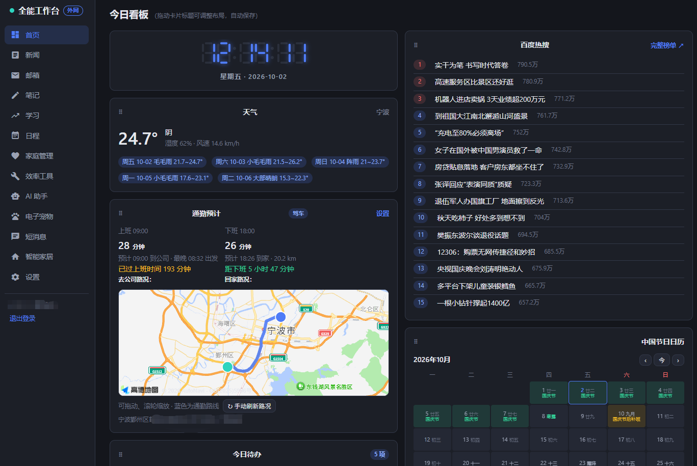

*首页——天气、今日待办与日程、快捷启动、热搜榜、中国节日日历（农历 · 节气 · 家人生日）、科技新闻、子女任务，一屏总览。*

## 功能总览

| 模块 | 主要能力 |
|------|---------|
| 首页 | 天气、今日待办 / 日程、快捷启动、热搜榜、中国节日日历（含农历 / 节气 / 家人生日）、科技新闻、子女任务一屏总览 |
| 新闻 | 科技 / 生活 / 本地三类来源每天 08:00 自动抓取（RSS + AI 搜索双通道），按 URL 去重、全中文过滤；本地新闻按天气城市过滤；历史留存 90 天可按日期翻阅 |
| 邮箱 | **多账号管理**（每个邮箱独立页签，标签名可自定义；邮箱设置为最后一个页签）、IMAP 拉取含正文邮件与附件、SMTP 收发信（写信 / 草稿 / 发件箱 / 垃圾箱 / 通讯录）、**写信支持上传附件**（详见下文）、**搜索筛选 + 全选 + 批量删除 + 批量已读**、新邮件右下角弹窗提醒（可开关弹窗 / 提示音，点击直达对应邮箱）、**关键词标签**（命中预设关键词的邮件在标题前显示橙底白字标签，如「发票」）、附件橙底白字数量标签、列表双列布局（第一列显示发件人姓名） |
| 笔记 | Markdown 笔记（进入即显示最新一篇的预览）、分类管理、AI 总结 |
| 日程 | 日历优先视图（月历铺排、跨日日程、农历 / 节日 / 信用卡账单还款日、共享日程）+ 待办清单（优先级 / 截止日期）、批量登记入日程、日程钉钉提醒 |
| 家庭管理 | 家庭事项登记（富文本 + 图片）、孩子档案（公历 / 农历生日、星座、生肖、虚岁自动计算）、学习任务下发与完成跟进、事项推送站内消息；**个人账务**为最后一个页签（支付宝账单 CSV 导入、关键词 + AI 双通道自动分类、科目 / 预算 / 固定支出、看板 + 排行 + 年度曲线） |
| 学习 | 听写、视频教学（NAS 目录浏览 / 进度记忆 / 学时记账）、打字练习（游戏 / 诗词 / 歌词 / 钢琴四模式、内容可自定义导入、赚钱日历）、练琴录音、学习计划 / 学习记录 / AI 一键复盘、心愿卡 |
| 效率工具 | **智作平台**（AI 文案创作子应用，同源嵌入）、**录音转写**（VibeVoice，服务器 / 客户端双引擎）、**剪贴板采集**（Windows 三件套自动推送）、快捷启动、学习计划 / 记录 / 复盘、**电脑监控**（Windows 屏幕定时上报 + AI 概览）、**语音配音**（MOSS-TTS 引擎一键安装）、**推送任务**（原业务系统：外部系统登记、Skill 引导词任务、Playwright 自动化、定时执行与推送）、**文件存档**（倒数第二页签）、**全局搜索**（最后页签） |
| 文件存档 | 文件管理、零依赖文字提取（docx / xlsx / PDF / 老 doc / xls）、图片型 PDF 视觉模型识读、家庭档案图床（作为效率工具页签展示） |
| AI 助手 | 任意 OpenAI 兼容接口（DeepSeek、通义千问、Kimi、OpenAI 等），附件（文档 / 图片）、独立视觉模型配置 |
| 电子宠物 | 像素宠物养成（喂养 / 病史 / 好感度 / 死亡机制）、多宠物、每日打卡、养育记录、桌面悬浮窗与 Windows 桌面宠物；**可见性 = 分配名单**：谁在「宠物分配」里被勾选，谁页面上才显示该宠物（管理员也不例外，见下文） |
| 智能家居 | 小米米家账号 OAuth 绑定，家庭 → 房间 → 设备卡片总览与控制（详见下文）；**智能板**（小智 Korvo2V3 语音板：装机向导 + 唤醒词在线改一键编译烧录 + **语音控米家**——对小智说话即开关米家设备，详见下文；可控设备一览**默认直接展开**，多路开关的**父设备**以圆角标签标注——无开关无别名框，只提示各分路独立可控）；**贾维斯J.A.R.V.I.S.**（子页签，v1.9.31 原叫「语音助手」，v1.9.33 改名并挪到本页第一个）：指定成员后，对小智说话即可**语音查工作台资料**（笔记 / 待办 / 家庭 / 学习 / 剪贴板 / 新闻 / 邮件 / 文件，复用全局搜索）+ **点名把任务转交给局域网里的自家 agent**（默认名「贾维斯」，可配 IP / 端口 / 模型 / 密钥），另有**官方 MCP 接入点**通道（加了工具、改了 agent 名都不用再烧固件）；**Agent红绿灯**（子页签）：ESP32-C3 三色灯 = **九家 AI agent 状态指示灯**（Claude/Codex/WorkBuddy/CodeBuddy/Cursor/dsh/Hermes/Gemini/Qwen），面板内三段——**功能介绍**（示例图 + 灯效对照 + 九家兼容说明）/ **下载安装包**（Windows/macOS 双打包 + 子文件清单）/ **安装步骤**（刷板子 → 电脑钩子 → 蓝牙配对，附参考文档）；**视频中心**（本页最后一个页签）：视频教学的精简版——左目录树 + 右播放区直接浏览播放 NAS 视频（FLV 转封装 / 本地直连加速 / **PotPlayer · VLC 外部播放器联动**与视频教学共用同一份注册脚本），按人记忆进度**断点续播**；视频下方另有**播放历史**（时间 / 所在文件夹 / 文件名 / 完整路径，倒序、默认每页 5 条可翻页并可改 5/10/15/30/50，点行即重开）、**文件夹内循环播放**（默认开，播完自动接同文件夹下一个、末尾回到开头，不含子文件夹）、**外部播放器**按钮（VLC / PotPlayer，官方下载地址见页面说明）；无学年学科 / 注意力点检 / 文档预览 / 学时记账，目录在「设置 → 智能家居视频路径」配置 |
| 短消息 | 成员间站内消息（气泡会话、右下角常驻未读弹窗）、**语音消息**（录 60 秒语音发微信式气泡，可反复播放，自动用「录音转写」引擎转文字显示在气泡下方，失败可手动重试，支持群发；录音方法对齐「录音转写」页——自动增益 + opus 编码 + 高质量重采样，转写**优先 Whisper large-v3-turbo**（未装回退 VibeVoice）并在文字下方小字标注所用模型与转写耗时，语音条默认主题「某某发出的语音信息」）、**电脑桌面通知**（下载批处理双击即装、随系统自启——有新消息从屏幕右下角弹窗，内容与网页弹窗一致，点击弹窗任意位置=已读并自动打开消息页；脚本按打开工作台的网络路径内嵌地址，内网装=内网、外网装=外网；语音弹窗可自动播放声音，安装/卸载都在短消息页底部）、钉钉 Stream 机器人收发、模块事项自动推送（新邮件提醒也走此通道） |
| 全局搜索 | 跨笔记、待办、日程、家庭、子女任务、学习记录、剪贴板、新闻、文件的全文搜索；页面右下角常驻**悬浮搜索框**（短输入框 + 搜索按钮，空输入点击直达搜索页，带词搜索自动执行） |
| 设置 | 系统名称、页面排序与改名、天气 / 通勤、新闻源、AI / 视觉模型、钉钉 / 飞书推送、信用卡账单日、模块共享开关、SSL 自签名证书、系统升级、多平台分享、**前端错误上报**（管理员诊断：前端异常自动上报环形存储、可查可清）、**用户管理**（成员账号、页面 + 页签双层授权，作为设置页签提供） |
| 定时任务 | 新闻抓取、Skill cron、日程提醒巡检、**邮箱按账号独立轮询**、SSL 到期检查、每周数据清理等自动运行 |

## 界面与模块详解

### 首页


*首页——天气、今日待办与日程、快捷启动、热搜榜、中国节日日历、科技新闻、子女任务，一屏总览。*

- **天气**：设置里填城市名即定位——内置全国约 400 条城市坐标库，国内城市**离线即存，不需要 Key，也不要求服务器能上外网**；区县 / 境外城市走在线定位兜底
- **今日待办 / 日程**、**中国节日日历**（公历节日 + 农历 + 二十四节气 + 家人生日 + 信用卡账单还款日）、**热搜榜 / 科技新闻**、**快捷启动**、**子女任务**各占一块，每天打开一屏看完

### 新闻

- 科技 / 生活 / 本地三类来源，每天 **08:00 自动抓取**（RSS + AI 搜索双通道），按 URL 去重、全中文过滤
- **本地新闻按天气城市过滤**；历史留存 90 天，可按日期翻阅
- 内置实测可用的科技 / 生活 RSS；「本地」建议替换为你所在城市的 RSS 源

### 笔记

- Markdown 笔记，进入即显示最新一篇的预览
- 分类管理、AI 总结

### 邮箱（多账号）

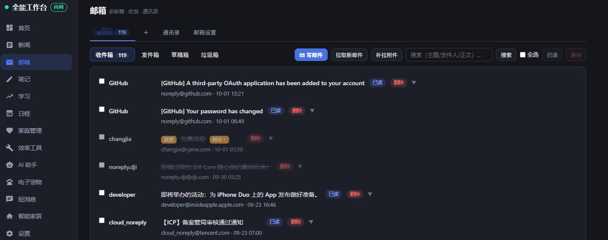

*邮箱——顶部按账号分页签、文件夹行、双列列表（第一列发件人），操作按钮固定锁定在标题行最右端。*

- **邮箱页签**：顶部按账号分页签（标签名可在邮箱设置中自定义），「＋」添加新账号，「邮箱设置」固定为最后一个页签；URL 带 `?acc=账号ID` 可直达
- **写邮件**：✉ 写邮件按钮位于**每个邮箱自己的页签内**（文件夹行最右侧）——在哪个邮箱的页签里点，就用哪个邮箱发件；写信窗口为放大版（约 880px 宽、正文 14 行），**默认显示当前邮箱的发件地址**，多邮箱时也可在窗口内切换发件账号
- **附件上传**：写信窗口内「📎 添加附件」可多选文件（最多 10 个、合计 ≤20MB），发送时随邮件经 SMTP 附件编码（base64 + MIME multipart/mixed，中文名 RFC 2231 编码）发出；发件箱中的邮件会显示「附件 N」标签与文件清单
- **操作按钮锁定行尾**：收件箱 / 发件箱 / 草稿箱 / 垃圾箱的文件夹行中，全部操作按钮（拉取新邮件、补拉附件、清空垃圾箱、搜索、全选、批量已读 / 删除）**固定锁定在标题行最右端**，不随内容换行漂移；窄屏时文件夹 tab 与按钮组各自横向滚动
- **批量操作**：四个文件夹均支持主题 / 发件人 / 正文搜索筛选 → 全选 → 批量已读 / 批量删除（垃圾箱内为彻底删除）
- **新邮件提醒**：按账号独立轮询（每账号独立间隔），新邮件走站内消息弹窗（点击直达对应邮箱页签）；弹窗与提示音可按需开关
- **关键词标签**：邮箱设置中维护「关键词 → 标签」规则，新邮件全文检索命中即在标题最前显示标签（每封邮件最多一个，首个命中优先）
- **附件存储**：拉取到的附件可统一落盘到 NAS 目录（邮箱设置 → 邮件附件存储），未配置时仅登记不落盘

### 学习


*学习 → 心愿卡。*

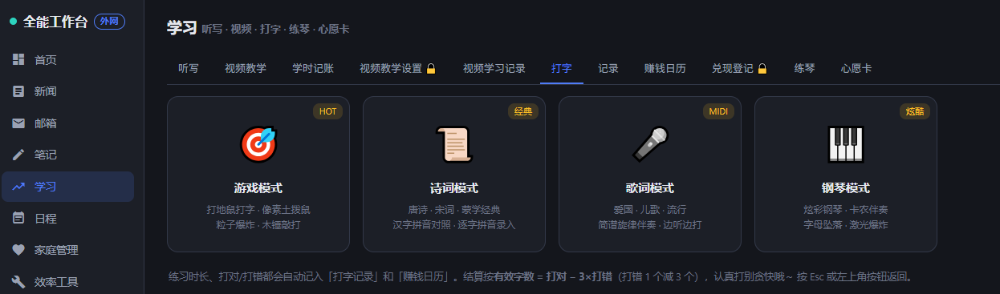

*学习 → 打字练习：游戏 / 诗词 / 歌词 / 钢琴四种模式，内容可自定义导入，带赚钱日历。*

- **听写**、**视频教学**（NAS 目录浏览、播放进度记忆、学时记账）、**打字练习**（游戏 / 诗词 / 歌词 / 钢琴四模式，内容可自定义导入，含赚钱日历）、**练琴录音**、**学习计划 / 学习记录 / AI 一键复盘**、**心愿卡**
- 视频教学的播放能力（FLV 转封装、本地直连加速、PotPlayer / VLC 外部播放器联动、复制直链）与「智能家居 → 视频中心」共用同一套，**联动注册脚本装一次两个页面都能用**

### 日程

- 日历优先视图：月历铺排、跨日日程、农历 / 节日 / 信用卡账单还款日、共享日程
- 待办清单（优先级 / 截止日期）、批量登记入日程、日程钉钉提醒

### 家庭管理

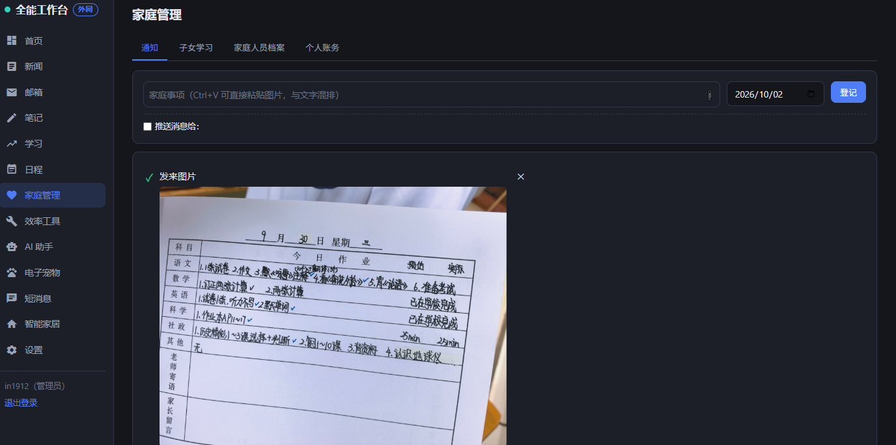

*家庭管理 → 通知：家庭事项登记（富文本，Ctrl+V 可直接粘贴图片与文字混排），可勾选「推送消息给」指定成员。*

- **家庭事项登记**（富文本 + 图片）、**孩子档案**（公历 / 农历生日、星座、生肖、虚岁自动计算）、**学习任务下发与完成跟进**、事项推送站内消息
- **个人账务**（本页最后一个页签）：支付宝账单 CSV 导入、关键词 + AI 双通道自动分类、科目 / 预算 / 固定支出、看板 + 排行 + 年度曲线

### 效率工具

本页页签依次为：智作平台 / 录音转写 / 剪贴板 / 快捷启动 / 学习计划 / 学习记录 / 复盘 / 电脑监控 / 语音配音 / 推送任务 / 文件存档 / 全局搜索。

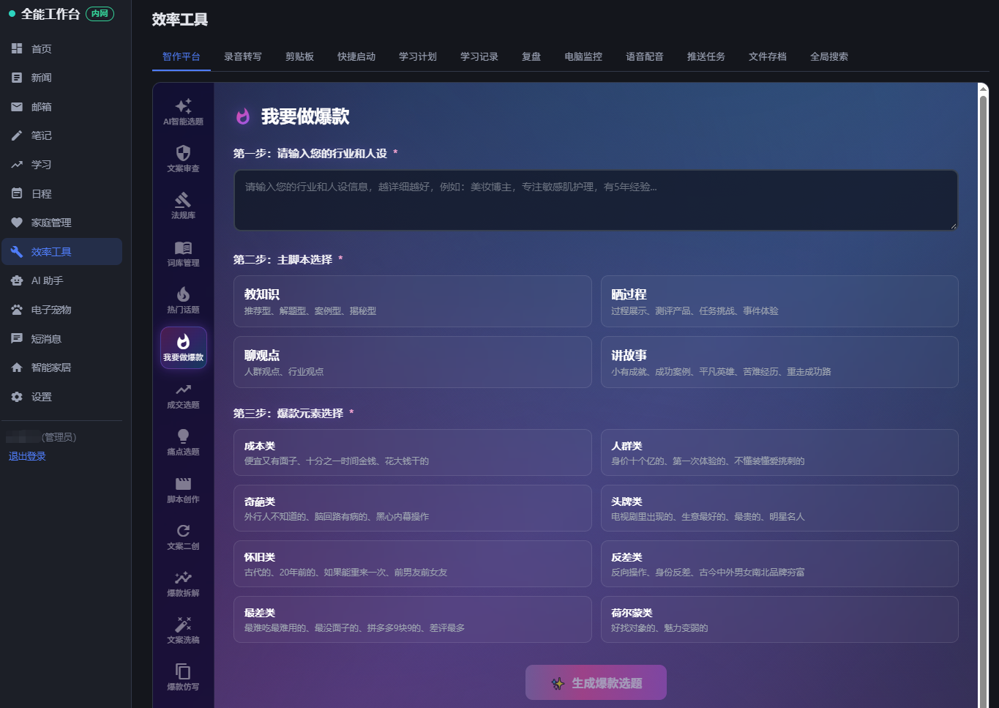

*效率工具 → 智作平台：AI 文案创作子应用，左侧十余个子工具（AI 智能选题 / 文案审查 / 法规库 / 词库管理 / 热门话题 / 我要做爆款 / 成交选题 / 痛点选题 / 脚本创作 / 文案二创 / 爆款拆解 / 文案洗稿 / 爆款仿写），主区是「我要做爆款」的三步表单——行业人设 → 主脚本（教知识 / 晒过程 / 聊观点 / 讲故事）→ 爆款元素。*

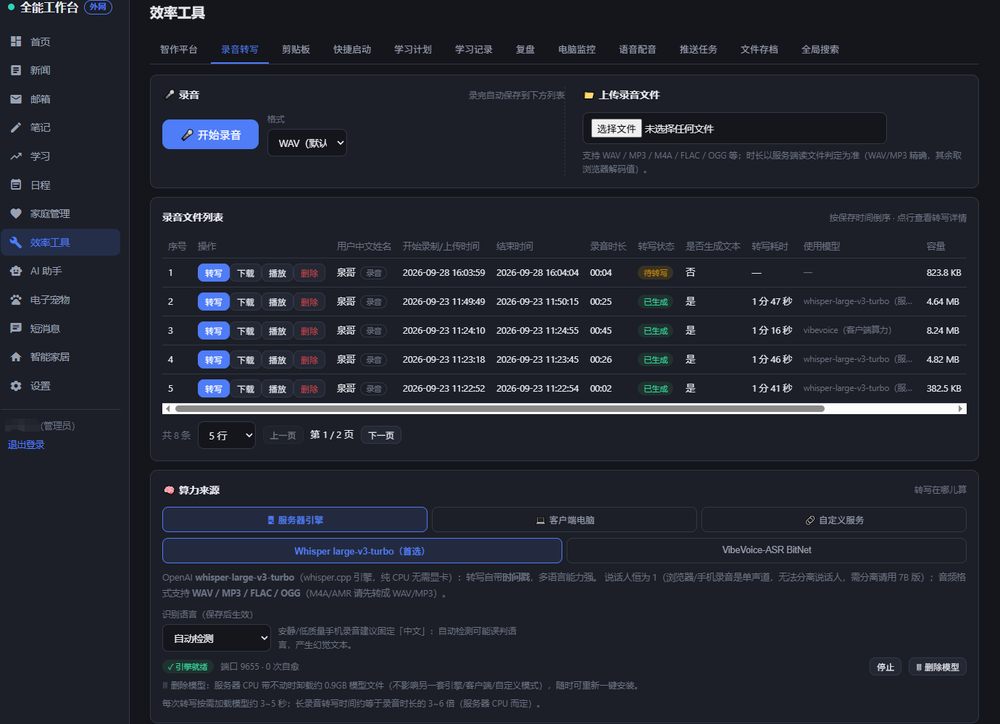

*效率工具 → 录音转写：录音保存三节点进度条、转写实时进度（按历史耗时估算）、说话人分离。*

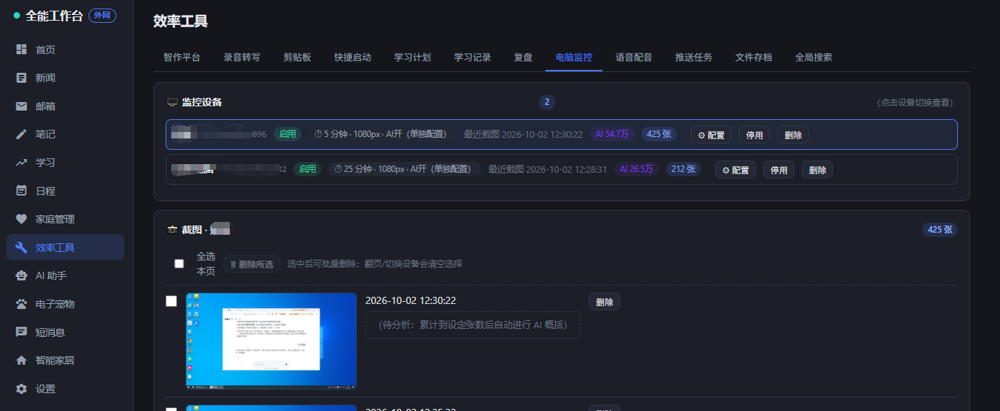

*效率工具 → 电脑监控：每台电脑一行（间隔 / 分辨率 / AI 开关 / 最近截图时间 / 词云 / 张数），下方是截图流，可勾选批量删除。*

- **智作平台**：AI 文案创作子应用（同源嵌入，独立子进程、仅本机回环，对外只走 `/zhizu` 反代）——十余个子工具覆盖从选题、审查、词库到脚本创作、二创、爆款拆解与仿写的完整链路
- **录音转写**、**电脑监控**：见下面两小节
- **剪贴板采集**：Windows 三件套自动推送
- **快捷启动**：常用页面与外部链接
- **学习计划 / 学习记录 / 复盘**
- **语音配音**：MOSS-TTS 引擎一键安装（模型首次使用时自动下载）
- **推送任务**（原业务系统）：外部系统登记、Skill 引导词任务、Playwright 自动化、定时执行与推送
- **文件存档**（倒数第二页签）：文件管理、零依赖文字提取（docx / xlsx / PDF / 老 doc / xls）、图片型 PDF 视觉模型识读、家庭档案图床
- **全局搜索**（最后页签）：跨笔记、待办、日程、家庭、子女任务、学习记录、剪贴板、新闻、文件的全文搜索；页面右下角常驻**悬浮搜索框**（空输入点击直达搜索页，带词搜索自动执行）

#### 录音转写（VibeVoice）

- **服务器引擎**：Whisper large-v3-turbo（含 Docker 侧车），适合部署在有算力的服务器 / NAS
- **客户端引擎**：1.5B 量化版（CPU 可跑）或 7B 完整版（需 NVIDIA 显卡），一键部署包自动安装——转录算力落在自己电脑，服务器零压力
- 短消息的语音消息转写也走这套引擎（**优先 Whisper large-v3-turbo**，未装回退 VibeVoice）

#### 电脑监控

Windows 代理 = 自安装 PowerShell 脚本（浏览器下载、双击安装、任务管理器可见的透明实现）：按间隔截屏缩放上传，支持**每台设备独立配置**（间隔 / 分辨率 / AI 分析 / 关键词预警 / 保留天数），预警命中可推钉钉；会话自动合并、AI 概览（需视觉模型）。

### AI 助手

- 任意 **OpenAI 兼容接口**（DeepSeek、通义千问、Kimi、OpenAI 等），填模型名 / API 地址 / API Key 即可
- 支持附件（文档 / 图片），可单独配置视觉模型

### 电子宠物（可见性 = 分配名单）

- 每只宠物创建时，**创建者自动进入该宠物的分配名单**；此后谁能在自己页面上看到这只宠物，完全由「宠物分配」里的勾选决定
- 从分配名单里取消勾选（包括创建者 / 管理员）后**立即生效且不再被自动加回**——该宠物从对应成员的页面消失；创建者与管理员始终可以在「宠物分配」页重新勾选回来
- 管理员默认也**只看到自己创建 / 被分配的宠物**（不再全量混入全家宠物）；确实需要代管全部宠物时，在「电子宠物 → 设置与预览」打开「管理员显示全部宠物」开关
- 其余机制不变：喂养 / 喂水冷却与每日上限、打字互动、生病 / 吃药 / 去世（含悼词）、粪便清理、好感度、成长圈、每日打卡、Windows 桌面宠物

### 短消息

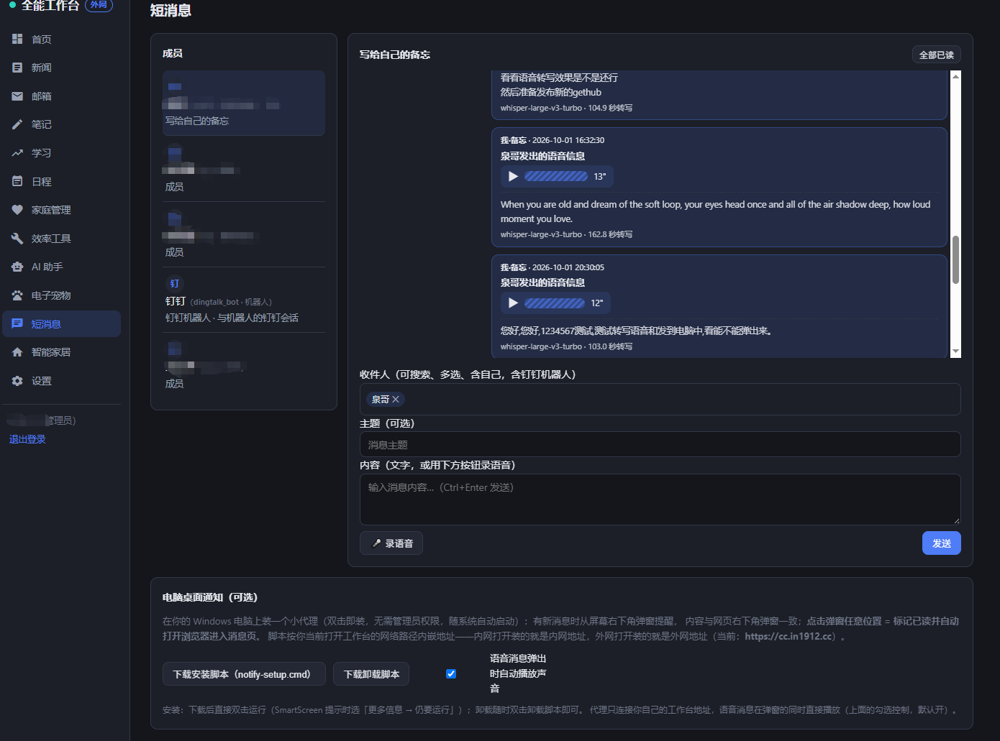

*短消息：成员间气泡会话、语音消息、电脑桌面通知；右下角常驻未读弹窗。*

- **站内消息**：成员间气泡会话，右下角常驻未读弹窗
- **语音消息**：录最长 60 秒语音发微信式气泡，可反复播放，发送后自动转文字显示在气泡下方（失败可点「点我转文字」重试），支持群发
- **电脑桌面通知**：短消息页底部下载批处理，双击即装（无需管理员权限、随系统自启）——新消息从屏幕右下角弹窗，**点击弹窗任意位置 = 已读并自动打开消息页**；脚本按打开工作台的网络路径内嵌地址
- **钉钉 Stream 机器人**收发、**模块事项自动推送**（新邮件提醒也走此通道）

### 智能家居

本页页签依次为：米家 / 智能板 / Agent 红绿灯 / 米家设置 / 米家参数翻译 / 视频中心。

#### 米家

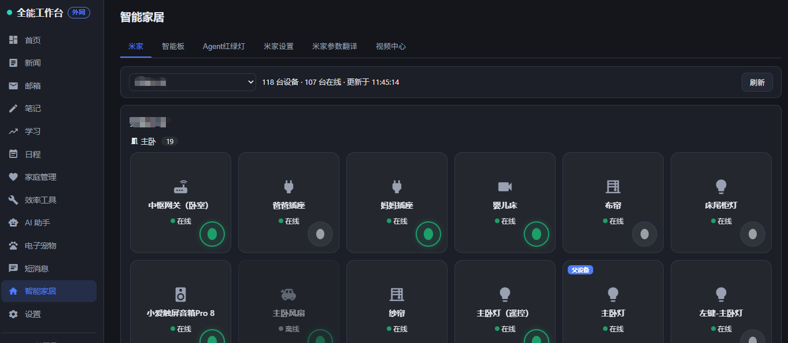

*米家：家庭下拉 + 设备卡片按房间铺排（在线状态、温度 / 空气质量直显、父设备角标），卡片上直接圆形开关。*

通过小米账号 OAuth2 官方授权（与 Home Assistant 官方集成同通道）接入米家云端：

- **绑定**：生成授权二维码（或电脑浏览器直接打开授权页）→ 小米账号确认 → 粘贴回跳地址完成绑定；访问令牌 AES-256-GCM 加密存储，到期自动续期，解绑即时失效
- **设备总览**：家庭 → 房间 → 设备卡片（在线状态、温湿度 / 空气质量直显、父设备与分路开关各归各位），有开关能力的设备卡片上直接圆形开关（乐观更新 + 失败回读校正）
- **设备详情**：全量 MIoT 规范能力（服务 / 属性 / 动作 / 事件），属性可读可写（布尔开关、枚举下拉、数值范围、字符串），动作带参执行
- **参数翻译**：内置静态词典 + 服务端设备实测词典（1300+ 词条），详情页参数名与枚举值中文化、括注英文原文，可搜索
- **纯云端调用**，不依赖局域网；仅操作账号下已在米家 App 绑定的成品设备

#### 智能板（小智 Korvo2V3 语音板）

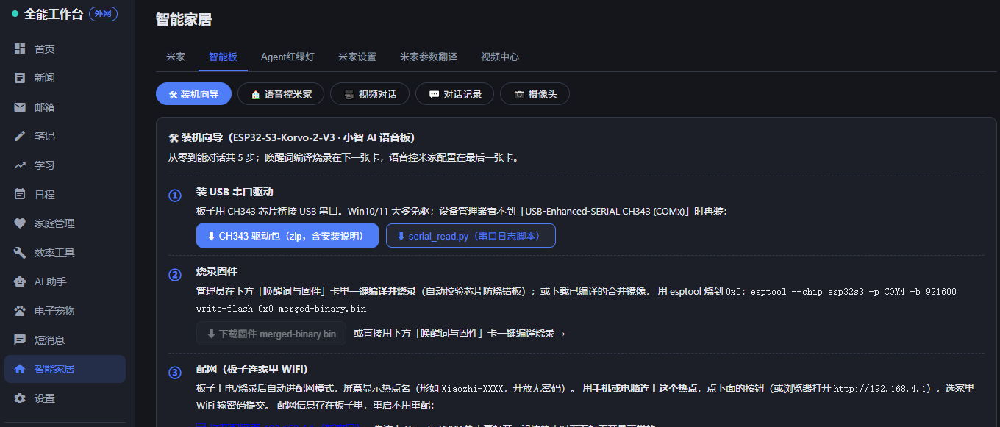

*智能板：装机向导（驱动 / 烧录 / 配网 / 控制台绑定 / 唤醒测试）、唤醒词在线改一键编译烧录、语音控米家。*

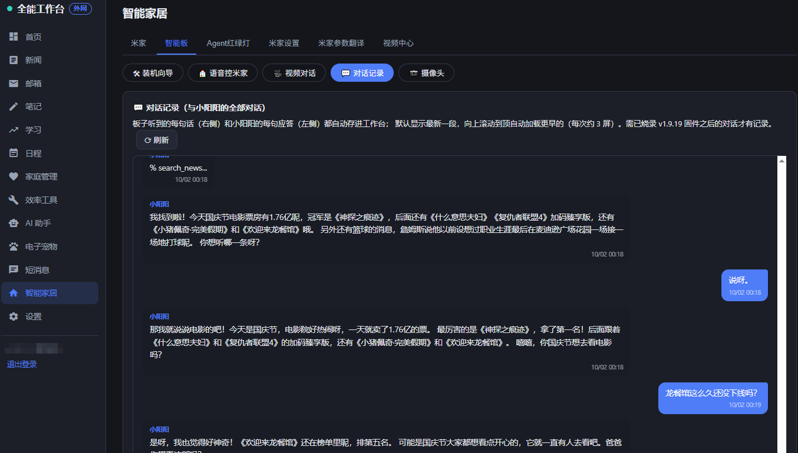

*智能板 → 对话记录：与「小阳阳」的全部对话，聊天窗口式浏览（左=应答，右=用户语音）。*

「智能家居 → 智能板」tab，把一块 ESP32-S3-Korvo-2-V3 小智 AI 语音板从零到「说话控全家」的完整链路收进工作台：

- **装机向导**：① CH343 串口驱动包 / 串口日志脚本下载 → ② 固件烧录（在线编译或下载镜像手动 esptool）→ ③ 配网（连上板子热点后新窗口链接直达板端配网页 `192.168.4.1`）→ ④ 小智控制台 xiaozhi.me 设备绑定（新窗口链接直达）→ ⑤ 唤醒测试话术
- **唤醒词在线改**：拼音 / 显示名 / 灵敏度阈值（1-99，越小越灵敏）表单 → 「编译并烧录」一键完成（服务端起 ESP-IDF 构建链：自动写板级 config.json、烧前 `flash-id` 强制校验芯片是 ESP32-S3 防烧错别的板、esptool 921600 烧录、进度与日志实时滚动）；产物镜像随构建归档，可供其它电脑下载手动烧录。构建能力探测：没有 ESP-IDF 工具链的环境（如 NAS 容器）自动降级为「文档 + 工具下载」模式，并支持配 **构建机地址**——本页直接代理下载构建机编译好的固件镜像 + 可复制的 esptool 烧录命令，在任意电脑上完成烧录
- **语音控米家**（独立子页签）：固件内注册 `self.workbench.list_devices / control_device / exec_text` 三个 MCP 工具，云端 AI 解析语音后经板子 HTTP 回连工作台桥接接口（免登录白名单 + 32hex 桥接密钥，可一键轮换）驱动米家设备——对着板子说「把客厅灯打开」即可；双通道可选：**直接 MIoT**（默认，开关类直达有回执）与**小爱智能屏转述**（自然语言指令交小爱解析，可覆盖「空调调到 26 度」等复杂操作，附试播 / 试执行按钮与 siid 自动探测）；「可控设备一览」与米家 tab 同源同刷（**默认直接展开**），多路开关的**父设备**以圆角「父设备」标签标注——无开关无别名框，只作提示（各分路有独立控制，照「米家」tab 的父设备标法）；支持**默认家庭下拉**（记忆选择、按家过滤）、**逐台快捷开关**（快速通断测试）与**语音别名**（接管式：登记别名后只认别名、本名退出匹配——两台重名设备给其中一台起别名即可消歧，喊被顶替的本名会得到新叫法提示；别名框紧贴设备名排列）
- **视频对话**（独立子页签）：**一个按钮同步开启**——「开启视频对话」同时拉起实时画面（MJPEG 流约 2-4 帧/秒，经工作台中转，外网打开生产页也能看）与板子对话模式（对板子说话、回应从板子扬声器播出，用的是板子的麦克风和喇叭），「结束」一键同收；两边状态分别可见，部分失败（如流断了、对话指令没通）再点一次按钮只补缺的那边；板子 IP 由轮询自动登记（固件自报 IP、服务端优先采用——生产端口转发改写来源地址也不怕），页面显示在线状态；需烧录支持该功能的固件（板内起 81 端口视频服务，桥接密钥校验）
- **对话记录**（独立子页签）：与板子的全部对话自动存入工作台——固件把云端识别出的用户语音和小阳阳的每句应答攒批上报（3 秒一批），页面聊天窗口式浏览（左=小阳阳应答、右=用户指令），默认滚到最新一段，向上滚动到顶自动加载更早的（每次约 3 屏，保留最近 5000 条）；需烧录支持该功能的固件
- **摄像头相册**（独立子页签）：固件新增 `self.workbench.take_photo` 工具——对着板子说「拍张照存相册」即拍照上传工作台；页面「📸 让板子拍一张」按钮主动触发（板子每 ~25 秒轮询指令，稍等即传）；照片点击放大、滚轮缩放、双击复位、ESC 关闭，管理员可删除，自动保留最近 200 张
- **贾维斯J.A.R.V.I.S.**（独立子页签，v1.9.31 原叫「语音助手」，v1.9.33 改名并挪到智能板页面第一个 —— 它是板子的主用途）：让板子除了控设备，还能**查资料**和**替你办事**。
  - **语音查工作台资料**：先指定一个成员（不指定就没法查——板子不知道查谁），之后说「查一下我的笔记」「装修花了多少钱」这类问题，它会去检索这个人的**笔记 / 待办 / 日程 / 家庭事项 / 子女任务 / 学习记录 / 剪贴板 / 新闻 / 邮件 / 账务 / AI 对话 / 文件存档**（复用「全局搜索」同一套检索，两处结果不会各说各话），再用 AI 归纳成一句话念出来。没配 AI 模型也能用——自动降级成只报条目名称。检索用的是**子串匹配**，所以云端 AI 被要求传简短关键词而不是整句；万一传了整句，服务端会自动剥离疑问词再逐个词重搜。
  - **转交家里的 agent**：把局域网里那台能读写文件、跑代码的 agent（如 Hermes）接进来，并给它**起个名字**（默认「贾维斯」，可加别名）。**只有明确点名它时才转交**——说「让贾维斯看看磁盘还剩多少」走它，其它问题仍由板子自己的小智 AI 回答；地址（填 `IP:端口` 就行，`/v1` 那一段会自动补）/ **Agent 名**（agent 的 profile 档案名，Hermes 里就是它暴露的那个模型/档案 ID，如 `fnnas-feishu`——不是下面给它起的说话名）/ 密钥都在面板里配，密钥加密存储、读取接口永不回显。点「测试连通性」不通时会把它实际试过的地址一并显示出来，便于对地址。安全闸门：**默认关闭**、必须点名、拦截危险动词（删除 / 格式化 / 关机 / 重启 / 执行 …）、按小时限流、**全程留痕**（页面下方「转交流水」列出谁在什么时候让 agent 办了什么事、被哪道闸拦下）。⚠️ **超过「同步等待上限」的长任务，答案会从智能屏播出来而不是板子**——板子会先说「还在算，算好了我用智能屏告诉您」，算完由智能屏补播。这是固件限制（云端驱动语音合成、工具调用必须同步返回），不是 bug。
  - **官方 MCP 接入点**：在小智控制台建一个 **MCP 接入点**，把地址（`wss://api.xiaozhi.me/mcp/`）和 token 填进来，工作台就会**主动连过去**、以 MCP 服务端身份对外提供上面两个能力。好处是**以后加功能、改 agent 名字都不用再烧录固件**（工具描述是每次现算的，改名立即生效）。与「设备侧工具」是两条并行通道，同时开会重名——**只开一条**。token 必须填在单独的 token 框里：**别把它拼进地址**（地址里带 token 会被拒绝保存——那会让密钥明文存库并回显给成员）。页面有连接状态灯。
  - **⚠️ 名字不是强凭证**：板子物理可及范围内的任何人都能喊它——这几道闸只降低误触发，不构成身份校验。所以 agent 默认关闭，且**绝不要**把那台 agent 的端口暴露到公网。
  - **查询查不到东西的四处修正（v1.9.33）**：报「我发的指令在工作台查询找不到具体的内容」——查过了，**不是权限问题**：配置指向的成员就是你本人、接入点是连着的、数据也都在。是检索本身有洞：① **日程从来没进过检索范围**，问「查一下我的日程」永远回「没找到」（偶尔返回几条，是别的表里恰好含「日程」两字）；现在日程（含地点）进来了，账务（交易对方 / 商品 / 备注）也一并补上。② **整句话查不到**：检索是「包含这段文字」式匹配，而中文没有词边界——「帮我查一下我的笔记有几篇」剥掉疑问词后剩「笔记有几篇」一整坨，拿去匹配一个字都中不了；现在会把长串切成 2~4 字的片段逐个试，靠前的字优先。③ **说类别名也查得到**：问「我的日程」时字面「日程」本来就不会出现在任何一条日程里（那条的标题是「牙科复诊」），所以命中类别词（日程 / 笔记 / 待办 / 邮件 / 文件 / 账务）而前面都没搜到时，直接给出该类最近的记录。④ **问数量的不再瞎报**：「我有几篇笔记」以前是让 AI 去数检索结果，而每类最多取 10 条，于是把 21 条念成「找到三条」；现在条数由数据库精确统计，AI 只负责组织语言。另外：问自己的笔记 / 待办 / 日程 / 邮件 / 文件时不再被转给家里的 agent（它看不到工作台数据库，转过去只会白跑），而转交时会明确要求带上你叫的那个名字。
  - **上手六处修正（v1.9.32）**：① 「查谁的资料」是**单选**下拉，而选择器组件只实现了多选的显示逻辑——点中的成员不出现标签、下拉里也不打勾、占位提示还不消失，看着就像点了没反应（值其实已经存下来了）；现在单选会正常显示已选成员并可点 ✕ 清空，直接刷新页面回到「语音助手」页签时成员列表也会自动加载（此前是空的，点开写「无匹配用户」，更像选不了人）。② 保存接入点地址与 token 后不再一直显示「未连接」——接入点是异步连的，保存那一刻必然还没握手完，而面板只在进页面时读过一次状态；现在保存后会自动盯着刷新（每 1.5 秒一次、最多 15 秒），连上即点亮状态灯，连不上会直接写出失败原因，另有「刷新状态」按钮可随时手动复查。③ 接入点对外声明的工作台版本号不再写死，跟随发行版本。④ **「转交家里 agent」不再一测就 404**：此前把地址拼成了 `http://IP:8642/chat/completions`，少了一段 `/v1`——Hermes 的 OpenAI 兼容接口在 `/v1/chat/completions` 上，所以密钥填对了也永远报「接口错误 404」；现在只填 `IP:端口` 会自动补全路径（填了自定义路径的照原样走），测不通时还会把实际试过的地址显示出来。⑤ 「模型名」更名为 **「Agent 名」** 并注明填的是 agent 的 **profile 档案名**（此前容易被当成「给它起的说话名」而填错）。⑥ **修「语音助手」页签下串出「摄像头相册」卡**：摄像头那块是子页签渲染链的兜底分支（`v-else`），而语音助手当初被单开成新的 `v-if`，于是两个页签内容同时显示；现在摄像头明确了只属于「摄像头」页签。
- **权限**：tab 归智能家居页；桥接密钥、配置保存、构建烧录、串口探测、删除照片均限管理员；快捷开关 / 请求拍照登录即可；固件桥接地址建议填 NAS 内网地址（板子与工作台同局域网时最快最稳）

#### Agent 红绿灯（九家 AI 状态灯）

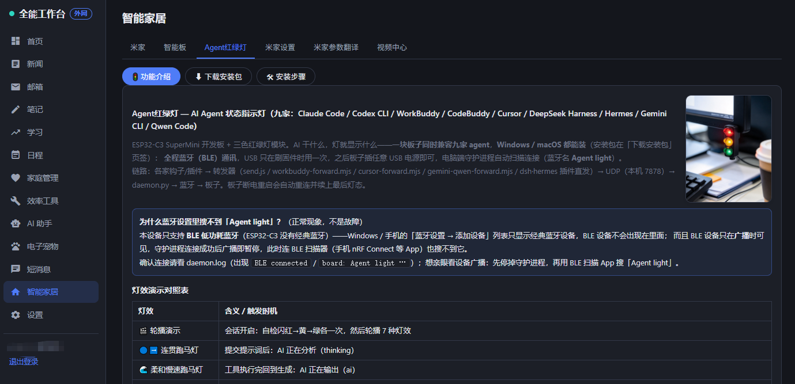

*Agent 红绿灯：ESP32-C3 三色灯 = 九家 AI agent 的状态指示灯，面板内分「功能介绍 / 下载安装包 / 安装步骤」三段。*

- 一块 ESP32-C3 三色灯 = **九家 AI agent 状态指示灯**（Claude / Codex / WorkBuddy / CodeBuddy / Cursor / dsh / Hermes / Gemini / Qwen），走蓝牙 BLE
- 面板三段：**功能介绍**（示例图 + 灯效对照 + 九家兼容说明）/ **下载安装包**（Windows / macOS 双打包 + 子文件清单）/ **安装步骤**（刷板子 → 电脑钩子 → 蓝牙配对，附参考文档）
- 位置在「智能板」之后；页签顺序与显示记忆在浏览器本地

#### 视频中心

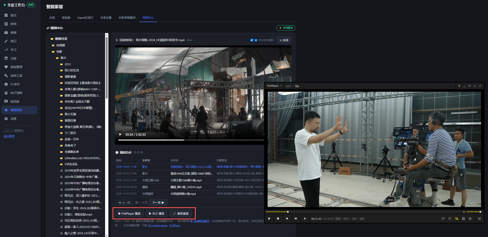

*视频中心：左目录树 + 右播放区，视频下方是播放历史（时间 / 文件夹 / 文件名 / 完整路径），外部播放器按钮在历史之下。*

「学习 → 视频教学」的精简版，本页最后一个页签：左目录树 + 右播放区直接浏览播放 NAS 里的视频 / 音频（mp4 · flv · webm · mp3 等），按人记忆进度**断点续播**（接近看完的从头播）。

- 保留视频教学那套播放能力：FLV 转封装、本地直连加速、**PotPlayer / VLC 外部播放器联动**（HEVC / 10bit / 4K 交给本地播放器硬解）与「复制直链」——**联动注册脚本与视频教学共用同一份**，装过一次两个页面都能用
- **播放历史**：时间 / 所在文件夹 / 文件名 / 完整路径，倒序、默认每页 5 条可翻页、每页量可改 5 / 10 / 15 / 30 / 50，**点任意一行即重新打开**
- **文件夹内循环播放**：播完自动接同文件夹下一个、末尾回到开头（不含子文件夹），标题栏有开关、**默认开启**、选择本地记住
- 去掉：学年 / 学科选择、注意力点检、文档预览区、学时记账与学习历史列表
- 目录在「设置 → 智能家居视频路径」配置（仅管理员），与视频教学目录**各自独立**

### 设置

本页页签依次为：常规设置 / SSL 自签名 / 升级管理 / 飞牛应用 / 登录日志 / 前端错误 / 用户管理 / 多平台。

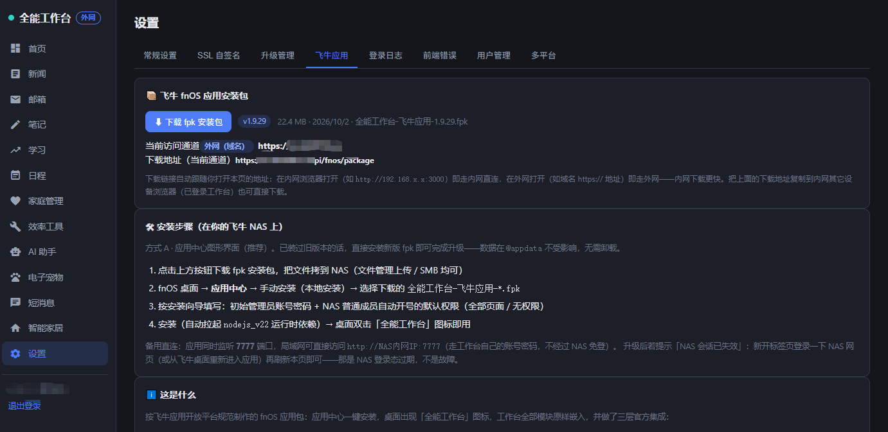

*设置 → 飞牛应用：一键下载 fnOS 应用 fpk 安装包（下载地址自动跟随当前访问通道），下方是安装步骤与形式说明。*

- 系统名称、页面排序与改名、天气 / 通勤、新闻源、AI / 视觉模型、钉钉 / 飞书推送、信用卡账单日、模块共享开关、SSL 自签名证书、系统升级、多平台分享
- **前端错误上报**：前端异常自动上报环形存储，管理员可查可清
- **用户管理**：成员账号、页面 + 页签双层授权（作为设置页签提供）
- **飞牛应用**：fpk 在线下载 + 安装步骤（仅管理员与获授权成员可见），详见下文「飞牛 fnOS NAS」一节

### 定时任务

新闻抓取、Skill cron、日程提醒巡检、**邮箱按账号独立轮询**、SSL 到期检查、每周数据清理等自动运行。

## 快速开始

### Windows（推荐）

1. 安装 [Node.js 22 LTS](https://nodejs.org)（必须 22.5 以上）
2. 解压项目文件夹到任意位置（路径不带空格更省心）
3. 双击 `start.bat`：首次运行自动安装依赖并启动，浏览器打开 <http://localhost:3000>
4. 用 `admin` / `admin123` 登录，**立即到「设置 → 账号与安全」改掉默认密码**

> 命令行方式：`npm install && node --no-warnings server/index.js`

### macOS / Linux

```bash
npm install
npm run build:web   # 首次或前端有更新时构建
npm start           # http://localhost:3000
```

### Docker

```bash
docker compose up -d --build
```

- `restart: always` 开机自启；数据落在宿主 `./data` 卷，升级 / 重建容器不丢
- 容器内路径挂载注意：若在设置里配 NAS 目录（视频教学根 / 附件存储等），填**容器内路径**（如 `/vol1/media`），需要的话在 compose 里加对应卷映射
- 或用 `bash pack-deploy.sh` 生成全量部署包（含源码与数据目录）上传服务器

### 飞牛 fnOS NAS

按[飞牛应用开放平台](https://developer.fnnas.com/)规范打包的官方形态应用，fnOS 桌面**应用中心一键安装 fpk**：

- **统一网关嵌入**：桌面入口走 `https://NAS域名/app/qgworkbench`（复用 NAS 域名与 HTTPS，应用监听 `app.sock` Unix Socket）
- **NAS 账号免登**：网关校验 NAS 登录态后注入可信用户头，工作台按用户名自动开号（NAS 管理员 → 工作台 admin，普通成员 → user），从桌面点开即用
- **局域网直连**：同时监听 **7777** 端口，`http://NAS内网IP:7777` 走工作台自己的账号密码
- **fpk 获取**：工作台「设置 → 飞牛应用」tab 直接下载安装包——下载地址自动跟随当前访问通道（内网浏览器打开走内网、外网域名打开走外网），页面附安装步骤；fpk 文件在仓库 `server/fnos/` 随升级包分发
- **数据自治**：全部数据在 `@appdata/qgworkbench/data/`，升级装新 fpk 不丢；安装向导可选初始管理员与 NAS 成员默认权限
- **网关兼容设计**：网关部署下不发 `Authorization` 头（fnOS 网关会把它当 NAS 令牌校验并拒绝），认证走 `?token=` 查询参数 + `wb_token` Cookie 双通道；200 非 JSON 网关代答自动去头重试自愈；前端异常自动上报可在「设置 → 前端错误」查看——无需 SSH 也能远程排障
- 天气城市定位内置全国坐标库（约 400 条），NAS 出网受限也能即填即存

> 构建自己的 fpk：`node fnos/build-fpk.mjs` → `fnpack build` → `python fnos/fix-fpk-perms.py`（Windows 打包器权限位修复），详见 `D:\CC\飞牛应用-全能工作台-安装说明.md`。

## 首次配置建议

1. **系统名称**：设置 → 系统名称（浏览器标题 / 登录页 / 全站即时生效）
2. **天气**：设置 → 输入城市名 →「保存并定位城市」——内置全国地级市 + 知名县级市坐标库，国内城市**离线即存、无需 Key、无需服务器访问外网**；区县 / 境外城市自动走在线定位兜底
3. **AI**（可选但强烈建议）：设置 → 填模型名称 / API 地址 / API Key，任意 OpenAI 兼容服务均可；配置后新闻摘要、笔记总结、学习复盘、AI 助手、账务分类、电脑监控 AI 概览全部启用
4. **邮箱**：邮箱页 → 最后一个页签「邮箱设置」→ 添加账号（IMAP 服务器 / 账号 / 授权码，QQ、163 等均支持；发信再配 SMTP），可添加多个；提醒开关、关键词标签、附件存储目录也在这里
5. **新闻源**：内置实测可用的科技 / 生活 RSS；「本地」新闻建议替换为你所在城市的 RSS 源
6. **成员**：设置 → 用户管理（仅管理员）添加账号并勾选可访问的页面与页签

## 访问方式

- **换端口**：环境变量 `PORT`（如 `set PORT=3100` 后再运行 start.bat）
- **局域网**：默认监听 `0.0.0.0`，手机 / 平板连同一 WiFi 访问 `http://<电脑IP>:3000`（系统内「分享访问」页直接查看本机 IP；Windows 首次需放行防火墙端口）
- **外网**：自行配置内网穿透或反向代理域名；内置 SSL 自签名证书工具（设置 → SSL 证书）可为局域网 HTTPS 访问签发证书（含 SAN 多域名 / IP，Chrome / 苹果信任要求 ≤825 天）

## 数据存储与备份（重要）

| 部署方式 | 数据位置 |
|---------|---------|
| 本地直跑 | `data/workbench.sqlite`（主库）+ `data/tenant-*.sqlite`（各成员租户库） |
| Docker | 宿主 `./data` 卷（容器内 `/data`） |
| 飞牛 fnOS 应用 | `@appdata/qgworkbench/data/`（应用中心升级不丢；备份 = 拷这个目录） |

- **备份 = 复制整个 `data/` 目录**（外加 `zhizu/data/` 智作平台库）；恢复 = 拷回原位
- **完全重置**：停服务 → 删 `data/` → 重启（账号回到默认 admin/admin123）
- ⚠️ 切勿把 `data/` 放在云同步盘（OneDrive / 坚果云 / Synology Drive 等）目录下——同步锁文件会导致 SQLite 写入失败；自定义位置用 `DATA_DIR` 环境变量指向非同步目录

## 多成员（多租户）

系统支持类 SaaS 多成员，管理员建账号后每个成员是独立"租户"：

- **完全隔离**：笔记 / 待办 / 日程 / 邮箱（各账号邮箱配置独立）/ 文件 / AI 对话 / 账务 / 学习 / 家庭档案 / 推送任务与 Skill / 看板布局等
- **可共享模块**（管理员开关控制）：新闻抓取、节日、地图 Key、AI 配置、家庭与子女——共享时管理员统一配置，全员同享
- **双层授权**：页面级 + 页签级（如"只开邮箱的通讯录"、"只开效率工具的推送任务"），授权表格化勾选，受限功能默认关闭需显式授予
- **页面排序与改名**：管理员在设置中拖定侧边栏顺序、修改页面中文名，全员共用；代码默认顺序与名称即本仓库的默认侧边栏
- 删除成员时其租户库自动归档到 `data/archive/`，可恢复

## 版本升级

**方式一（覆盖升级）**：拿到新版本包后停服务，把新包的 `server/`、`web/dist/`、`web/public/`、`zhizu/`（不含 `zhizu/data/`）覆盖到旧文件夹——`data/` 永不覆盖——再启动。

**方式二（系统内差分升级）**：本地工作台「设置 → 升级管理」检测改动 → 打包（源码 + 前端构建快照 + manifest）→ 下载 zip → 目标机工作台上传应用，服务自动重启生效。升级日志全程记录版本号与内容，两端可见当前运行版本。也有 `scripts/build-full-package.js` 生成含依赖闭包的完整版升级包（老容器免 npm install）。远程部署脚本 `scripts/deploy-package.mjs` 目标地址与凭证全部走环境变量（`WB_URL` / `WB_USER` / `WB_PASS`），仓库不含任何部署目标信息。

## 技术架构

```
Vue 3 + Vite（SPA 单页应用，Material Icons，Vue 单色 favicon）
        │ REST API（同源部署，hash 路由）
Express + node:sqlite（主库 + 租户库多库架构）
        ├── 智作平台子进程（Express，127.0.0.1 回环通道，同源 /zhizu 反代）
        ├── 转写引擎边车（Whisper / VibeVoice，服务器或客户端算力）
        ├── TTS 引擎（MOSS-TTS-Nano，conda 环境一键安装，模型首用时自动下载）
        └── node-cron 定时任务 · rss-parser · imapflow（多邮箱） · 手写 SMTP 客户端（含附件 MIME） · OpenAI 兼容 AI
```

- **鉴权**：scrypt 加盐密码 + 会话令牌；页面 / 页签双层权限中间件；推送任务凭据、第三方令牌 AES-256-GCM 加密落库
- **浏览器自动化**：Playwright（Chromium 随 Docker 镜像打包），Skill 抓取配方支持登录 / 点击 / 开关 / 表格提取
- **推送**：钉钉（机器人单聊 / 工作通知 / Stream 机器人接收 / 扫码绑定）与飞书（交互卡片表格）

## 目录结构

```
personal-workbench/
├── server/           # Express 后端（API、权限、定时任务、SQLite、引擎管理）
│   ├── routes/       #   各模块 REST 路由
│   ├── services/     #   业务服务（米家、账务、邮件、新闻、飞书/钉钉、TTS…）
│   ├── whisper/      #   Whisper 转写引擎（多平台二进制）
│   └── vibeasr/      #   VibeVoice 客户端引擎（Windows/Linux）
├── web/              # 前端
│   ├── src/          #   Vue3 源码（views 页面 / components 组件 / nav.js 侧边栏清单）
│   ├── public/       #   Material Icons 字体、favicon.svg 等静态资源
│   └── dist/         #   构建产物（按时间戳版本目录，服务端自动托管最新）
├── zhizu/            # 智作平台子服务（独立进程；data/ 为其数据库）
├── tts/              # 语音配音（MOSS-TTS-Nano，模型首用时自动下载）
├── scripts/          # 构建/部署/运维辅助脚本（E2E 测试、全量打包、远程部署）
├── data/             # 全部业务数据（SQLite）——备份这里
├── start.bat         # Windows 一键启动（自检 Node 版本/依赖）
├── docker-compose.yml
└── Dockerfile
```

## 常见问题

- **启动报 Node 版本错误**：装 Node.js 22 LTS（start.bat 自动检测提示）
- **端口被占用**：换 `PORT` 环境变量
- **忘记 admin 密码**：更稳妥是提前在「设置 → 用户管理」加备用管理员；极端情况删 `data/workbench.sqlite` 可重置（丢全部账号数据，不推荐）
- **新闻抓不到**：容器 / 本机需能访问外网；个别 RSS 源失效可在设置替换；本地新闻依赖天气城市
- **邮件连不上**：确认邮箱已开启 IMAP（993/TLS）；QQ 等需在邮箱设置开启服务并使用授权码；多账号在邮箱页「邮箱设置」里逐一添加
- **发不出附件**：附件需该账号已配置 SMTP；单个附件 ≤20MB、最多 10 个、合计 ≤20MB；部分邮箱服务商对附件总大小另有上限
- **管理员看不到宠物**：宠物可见性只认「宠物分配」名单——到「电子宠物 → 宠物分配」勾选该成员即可；要临时总览全家宠物可打开「管理员显示全部宠物」开关
- **AI 报错**：base_url 需以 `/v1` 结尾（如 `https://api.deepseek.com/v1`），模型名与服务商一致
- **改前端后重新构建**：`npm run build:web`（需联网装前端依赖）；构建产物按时间戳目录托管，服务无需重启即可生效
- **SQLite 报错 no such column**：`node:sqlite` 严格拒绝 SQL 里的双引号字符串字面量，一律用单引号（见代码内注释）
- **飞牛网关下报「invalid token」**：已根治（网关部署不发 `Authorization` 头）；若仍出现多为浏览器 NAS 登录态过期——按提示重登 NAS 网页或从飞牛桌面重新进入应用即可
- **天气定位报「在线定位不可达」**：输入的城市不在内置坐标库且服务器无法访问 open-meteo——改填附近的市级城市名，或按报错里的原因码（ENOTFOUND / ETIMEDOUT 等）排查服务器外网 / DNS
- **下载的文件是「空的」/ 只有十几字节**：fnOS 网关部署下 NAS 会话失效时，网关会用 200 + `invalid token` 文本代答业务请求——会识别并提示；若遇到，打开 NAS 网页重新登录（或从飞牛桌面重新进入应用）后再下载即可
- **页面出红条 / 想反馈错误**：红条点击即复制完整堆栈；管理员可在「设置 → 前端错误」查看自动上报的历史异常
- **电脑桌面通知脚本下载后双击没反应 / 被拦截**：SmartScreen 提示时选「更多信息 → 仍要运行」；脚本装在 `%LOCALAPPDATA%\WorkbenchNotify`（开机自启、无需管理员权限），卸载随时在短消息页下载卸载脚本双击即可；只装一个代理时注意——脚本内嵌的是**下载时打开工作台的那个地址**，内网 / 外网地址不同不影响消息接收（都能连上服务器即可）
- **语音消息没有自动转文字**：服务器需安装「录音转写」引擎（效率工具 → 录音转写）；短消息转写**优先 Whisper large-v3-turbo**（装了就用，未装回退 VibeVoice）；未装或失败时气泡下会出现「未转写 · 点我转文字」，装好引擎后点它即可手动重试，语音本体不受影响随时可播。转写成功后文字下方的小字标注本次所用模型与耗时
- **「视频中心」打不开视频 / 提示未配置**：先到「设置 → 智能家居视频路径」填 NAS 目录（Docker 部署填**容器内路径**，先把 NAS 目录映射进容器），与视频教学的目录互不影响；点「PotPlayer / VLC 播放」没反应时先在页面点「⬇ 安装联动脚本」双击运行一次（与视频教学共用，装过即免）；4K / HEVC 视频浏览器放不动属解码上限，用外部播放器按钮交给本地播放器硬解

## 安全说明

- 密码 scrypt 加盐哈希存储，登录失败连续多次自动锁定
- 页面 / 页签双层权限控制，管理员可精确分配每个成员的可见范围
- 推送任务凭据、米家令牌、邮箱授权码等敏感配置 AES-256-GCM 加密存储；日志不落敏感信息
- 对外分享类功能默认关闭，开启后可随时一键停用
- 本项目面向个人 / 家庭自托管场景，请勿用于商业用途
